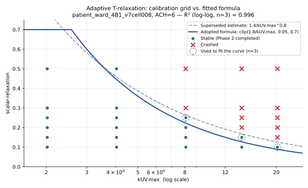

# Analysis Log

A running record of findings from GUV-CFD simulation results — as opposed to
`CHANGELOG.md`, which records changes to the tool itself. Each entry documents
what a run's data showed, the statistics behind it, and the physical
interpretation, so results don't have to be re-derived from scratch in a later
session.

---

## 2026-07-25 — `patient_ward_4B1_v8_simdcay`: effective eACH_UV scales sub-linearly with Z, not proportionally

**Run**: full Z × ACH sweep (Scenario Runs), Z ∈ {1.7, 3.4, 6, 8.5} cm²/mJ ×
nominal ACH ∈ {3, 6, 9}/hr, 12 combinations, `patient_ward_4B1_v8_simdcay`
under `~/OpenFOAM/hclaus-v2412/run/`. First real use of the batch sweep
feature added 2026-07-19.

**Question**: the well-mixed model assumes `eACH_uv_well_mixed = Z × mean
fluence rate × 3.6` — a direct multiplication, so it is *exactly* proportional
to Z by construction (verified: `eACH_well_mixed / Z` = 10.330 across all 12
runs, std ≈ 3×10⁻¹⁵). Does the CFD-fit *effective* eACH (the real,
imperfectly-mixed room's actual decay rate, minus a ventilation baseline) show
that same proportionality, or something else?

**Data fields used**: `eACH_uv_effective_corrected` (CFD decay-curve fit,
baselined on the *measured* ventilation-only decay rate from a UV-off control
run, not the nominal ACH setpoint — see `decay_analysis.compute_effective_eACH`
and `write_results_summary`'s `_corrected` fields) and
`mixing_efficiency_corrected` (= effective ÷ well-mixed).

### Finding 1 — Sub-linear power law, not proportional

Per-ACH log-log fits of `eACH_effective = a·Z^b`:

| nominal ACH | b (exponent) | 95% CI | R² | p (b = 1) |
|---|---|---|---|---|
| 3 | 0.799 | [0.705, 0.893] | 0.9985 | 0.012 |
| 6 | 0.904 | [0.856, 0.952] | 0.9997 | 0.013 |
| 9 | 0.929 | [0.893, 0.966] | 0.9998 | 0.014 |

All three reject b = 1 (proportional) with p < 0.02. Doubling Z delivers
roughly a 1.7–1.9× gain in effective eACH, not 2×.

**Is this fit noise?** No — each run's own CFD decay-curve regression is very
tight (fit_n = 101–242 points, 95% CI half-width only 0.13–0.20% of the eACH
value), while the deviation from a proportional prediction reaches 10.9–28.0%
depending on ACH — 50 to 200× larger than the statistical noise. This is a
physical saturation effect in the CFD transport, not a fitting artifact.

**Mechanism (hypothesis)**: mixing-limited (transport-limited) saturation.
Raising Z increases the local UV reaction rate near the lamps, but the rate at
which fresh (unirradiated) air is carried into that high-fluence zone — and
treated air carried back out to the rest of the room — is set by advection,
not by Z. Past a point, extra lamp power increasingly acts on air that has
already been treated on a prior pass through the high-fluence region, so the
marginal return on Z shrinks.

### Finding 2 — Ventilation moderates the saturation (Z × ACH interaction)

b rises toward 1 as nominal ACH increases (0.80 → 0.90 → 0.93): more airflow
measurably relieves the bottleneck, though it hasn't closed it even at ACH9.
A combined log-log regression across all 12 runs,
`log(eACH) = c₀ + b_Z·logZ + b_A·logACH + b_int·logZ·logACH`, found the
interaction term significant: **b_int = 0.122 ± 0.024, p = 0.0009**
(F-test for adding the interaction to a no-interaction model: F = 26.6,
p = 0.0009). A single Z-only exponent cannot describe this dataset — how much
is lost to imperfect mixing at a given Z depends on how much ventilation is
present.

Mixing efficiency (effective ÷ well-mixed) falls monotonically with Z in
every ACH group (Pearson r ≤ −0.99, p ≤ 0.007 per group), and the fall is
steepest at the lowest ventilation rate — worst case is the low-ACH/high-Z
corner (mixing efficiency 0.43 at ACH3/Z8.5) vs. best case low-Z/high-ACH
(0.64 at ACH9/Z1.7).

### Finding 3 — Consistency check: b and mixing-efficiency decline are the same signal

Since `eACH_well_mixed = 10.330·Z` exactly, `mixing_efficiency =
eACH_effective / (10.330·Z)`. If `eACH_effective = a·Z^b`, this forces
`mixing_efficiency = (a/10.330)·Z^(b−1)` — algebraically the same
nonlinearity, not independent evidence. Verified numerically: regressing
`log(mixing_efficiency)` on `log(Z)` directly reproduces `b − 1` to machine
precision in all three ACH groups (e.g. ACH3: −0.2010 both ways).

What *is* a useful check: does the eACH power-law fit (done in log-eACH
space) hold up when read back out in plain mixing-efficiency space? Yes — a
parity plot of predicted vs. actual mixing efficiency across all 12 runs
gives R² = 0.987, RMSE 0.4–1.0 percentage points, max error 1.2 points (at
ACH3, the noisiest group). The single number `1 − b` ("saturation strength")
alone predicts the *total* relative mixing-efficiency drop from Z=1.7→8.5
almost exactly:

| ACH | 1 − b | predicted drop | actual drop |
|---|---|---|---|
| 3 | 0.201 | 27.6% | 28.0% |
| 6 | 0.096 | 14.3% | 14.6% |
| 9 | 0.071 | 10.8% | 10.9% |

b also tracks the mean mixing-efficiency level across the 3 ACH groups
(r = 0.998) — but that's only 3 points (one per group), descriptive only,
not a real inference.

### Finding 4 (secondary) — Ventilation boundary condition under-delivers by a constant ~56%

Across all 12 runs, measured/nominal ventilation-flow ratio (`ach_delivery.ratio`
in each run's report) is essentially one constant: 0.4384 (ACH3), 0.4395
(ACH6), 0.4390 (ACH9) — mean 0.4390, std 0.0005, correlation with nominal ACH
r = 0.51 (p = 0.09, not significant). The inlet BC is delivering only ~44% of
its nominal flow rate at every setpoint tested — this looks like a fixed
geometric/short-circuiting loss (inlet sizing or duct routing in this
particular room mesh) rather than a flow-regime-dependent artifact. It's why
the `_corrected` eACH fields (baselined on measured ventilation, not nominal)
are the ones to trust for this room — they run 10–30% higher than the
uncorrected `eACH_uv_effective` and tell a materially different story.

**Caveat**: this ~44% ratio is specific to this room/mesh's inlet geometry —
don't assume it generalizes. If a future room's sweep shows a very different
delivery ratio, that's expected; if a *nominally identical* room/mesh setup
shows a different ratio, treat that as a regression to investigate.

**Full write-up with interactive graphs**: published as a Claude artifact,
"eACH vs Z — patient_ward_4B1_v8_simdcay" (private; ask if you need the link
re-shared — artifact URLs aren't stable across machines/sessions unless
explicitly reshared).

**Open questions for a future sweep**: does the same sub-linear b(ACH)
relationship and ~constant delivery ratio hold on a different room geometry,
or is the specific exponent range (0.80–0.93) and the 44% delivery figure
particular to this mesh? Worth repeating this exact analysis on the next room
that gets a full Scenario Runs sweep.

---

## 2026-07-29 — ACH6 flow-field oscillation, a strategic refocus on reduction_pct, and a validated deltaT trick that makes low-ACH runs cheap

A single day's investigation that started as "why is the ACH6/Z6 flow base
taking so long to converge" and ended with a production default change to
how every steady-state Phase 1/2 run budgets its iterations.

### Finding 1 — ACH6's flow field is genuinely, persistently oscillating, not slowly converging

Pulled real per-iteration `p`/`Ux` residuals straight from `log.simpleFoam`
for the ACH6/Z6 flow base: a real, non-decaying oscillation with a ~300-400
iteration period, not noise and not a slow monotonic approach. The
convergence checker (`_is_stable_oscillation`) had never actually rendered a
verdict on this case — it needs `2 x oscillation_window` (default window 4)
chunks of history, and this project's own customized
`flow-max-iterations=1500` made that structurally unreachable (would need
≥4000 iterations just to be *eligible* for a verdict).

### Finding 2 — the oscillation matters far less to reduction_pct than to eACH_uv

Froze the same ACH6 flow field at two different oscillation phases (peak
and trough, via `converge_flow_field(resume=True, ...)`), then ran a full
Phase1(4000)+Phase2(2500) from each frozen state. `eACH_uv_steady_state`
swung ~20% between the two phases (64.79 vs 77.75), but `reduction_pct`
(the room's actual pathogen-reduction percentage) only swung ~1.3 points
(91.52% vs 92.84%). Mechanism: `reduction_pct = 1 - T_ss2/T_ss1` is a
*bounded ratio*, while `eACH_uv` involves `G/(V*T_ss2)` — T_ss2 sits in a
denominator, which amplifies the same underlying noise.

This directly reframed the project's priorities (this is a room/HVAC design
tool, not a metrology instrument): **reduction_pct is the number a user
actually needs** and is robust to flow-field noise the CFD can't fully
eliminate; eACH_uv is an "academic topping" that's inherently noisier and
shouldn't be over-trusted at the precision it's often reported to.

### Finding 3 — the codebase's math exactly matches a published reference

Cross-checked the steady-state model against the user's own co-authored
paper ("Air disinfection... large scale chambers", supplemental S1-3). The
governing equations (`AER=1/theta`, `R=AER+k_S+k_E`, `SS_1=S/(V*R)`,
`SS_2=S/(V*R_UV)`, and both phases' exponential-approach forms) match the
codebase's model exactly. The paper's stated criterion — **"SS_1 is
approached after roughly 4-6 residence times"** — became the theoretical
basis for Finding 4 below (residence time scales as 1/ACH, which is exactly
why low-ACH cases need proportionally longer runs).

### Finding 4 — deltaT can be scaled up for free in Phase 1/2, and it works

`simpleFoam`'s own U/p/k/omega solve has no time-derivative term at all
(pure SIMPLE relaxation) — the *only* place OpenFOAM's pseudo-time step
(`deltaT`) matters is `scalarTransport1`'s bolt-on `T` equation, solved
implicitly (unconditionally stable, no CFL-type limit). So scaling `deltaT`
up costs nothing and risks nothing to the frozen flow field, while letting
`T`'s own buildup traverse the paper's "4-6 residence times" within a fixed,
cheap iteration budget instead of needing more iterations.

Validated on 3 real cases, comparing a 1500/1000-iteration run using scaled
deltaT against a 4000/2500-iteration deltaT=1 baseline (2.67x more real
solver iterations):

| Case | Budget | reduction_pct | eACH_uv |
|---|---|---|---|
| ACH3/Z1.7 | 4000/2500, dt=1 (baseline) | 85.84% | 18.19 |
| ACH3/Z1.7 | 1500/1000, dt=1 (unscaled) | 75.60% | 9.30 |
| ACH3/Z1.7 | 1500/1000, scaled dt | 85.77% | 18.08 |
| ACH3/Z1.7 | 750/500, scaled dt (too short) | 87.90% | 21.79 |
| ACH6/Z6 (oscillating case) | 1500/1000, scaled dt | 92.46% | 73.59 |
| ACH9/Z6 | 1500/1000, scaled dt | 83.26% | 44.75 |

The scaled 1500/1000 run matches the 4000/2500 baseline almost exactly at
ACH3, and ACH6's scaled result (92.46%/73.6) lands squarely inside the
oscillation-driven noise band from Finding 2 (91.5-92.8%/64.8-77.8) —
indistinguishable from the full-budget run given the flow field's own
irreducible noise. Halving the budget again (750/500) undershoots even with
scaling — 1500/1000 is the validated floor, not 750/500.

**Now the production default** (`guvcfd.app_settings`: `deltat-scaling-
enabled=True`, `deltat-effective-fraction=0.7` — measured ACH/eACH runs
below nominal, conservative derating — `deltat-target-fraction=0.995`, ~5.3
residence times). Purely additive on top of the existing iteration-budget
safety margin, so a case that already converges fine at deltaT=1 (typically
higher-ACH) is completely unaffected — see `compute_scaled_delta_t`/
`resolve_phase_delta_ts` and "OpenFOAM settings background.md" for the full
implementation writeup.

### Finding 5 — the same trick does not carry over to decay mode

Decay mode's transient run uses `pimpleFoam`, where U/p *do* have real,
Courant-constrained time-derivative terms (`adjustTimeStep`, `maxCo 0.5`).
Every function object (including `scalarTransport1`) shares OpenFOAM's one
global clock, so `T` can't be given an independently-inflatable timestep the
way `simpleFoam`'s ddt-free U/p allowed in Phase 1/2 — scaling `deltaT` up
for `T` there would mean scaling it up for U/p too, risking real accuracy
loss in the transient flow itself. This also isn't a gap to fix later:
decay mode's whole method is to fit a *real* decay rate against real
elapsed time (`fit_effective_decay_rate`), so blurring time resolution would
bias the very quantity being measured. Decay mode also never had the
"iterations == seconds" conflation this fix addresses in steady state —
its own `_settling_iterations()`-derived `pimple_end_time` is already
consumed in real seconds, not iterations.

---

## 2026-08-01 — Wall-function y+ and inlet turbulence-intensity: one real (small) sensitivity, one negligible, no bug found

### Background — how `scalarTransport` produces exponential (not linear) UV decay

`cellzones.write_fvoptions()` writes one `scalarSemiImplicitSource` per
UV-rate bin, each with `injectionRateSuSp { T (0 -k); }` — an `(Su Sp)`
pair OpenFOAM adds to the transport equation as `source = Su + Sp*field`.
Here `Su=0` and `Sp=-k`, and critically `Sp` multiplies the field value
itself (the local concentration `C`), not a fixed number — so the sink term
is `-k*C`, proportional to whatever's currently in the cell. The governing
per-cell ODE is `dC/dt = -k*C`, which integrates to `C(t) = C0*e^(-kt)` -
exponential decay. Had `k` instead been placed in `Su` (a constant,
independent of `C`), the sink would remove scalar at a *fixed* rate
regardless of remaining concentration, giving linear decay (and eventually
negative `C`). OpenFOAM discretizes `Sp` implicitly (added to the solver
matrix's diagonal each timestep), so the solver is literally integrating
`dC/dt=-kC` cell-by-cell, coupled with whatever advection/diffusion moves
scalar between cells.

Per-cell `k = Z * fluenceRate * 1e-3` (`fluence.compute_inactivation_rate`)
is continuous, but `scalarSemiImplicitSource` only accepts one uniform
coefficient per `cellZone` — so `cellzones.bin_decay_rates()` log-bins `k`
into `nbins` groups (geometric mean of each bin's `[lo,hi)` edges as the
representative rate), each becoming its own `cellZone`/source block. This
is a discretization approximation, not something found replicated in the
UV-disinfection CFD literature — published Eulerian models typically apply
a genuinely continuous per-cell reaction rate (e.g. a UDF in commercial
code, or `codedFvOption`/`fvm::Sp(k_field, C)` in OpenFOAM), and Lagrangian
models sidestep the issue entirely by integrating dose along particle
tracks and applying a dose-response kinetic model afterward - see
Ho/Zhu/Malley-type UV reactor CFD papers.

Turbulent diffusion is explicitly on: `alphaD=1`/`alphaDt=1` in the
`scalarTransport1` functionObject give effective diffusivity
`D = alphaD*nu + alphaDt*nut`, with `nut` computed by `kOmegaSST` from its
own `k`/`omega` transport equations (an algebraic closure,
`nut = a1*k/max(a1*omega, b1*F2*sqrt(2*S:S))` - not a value chosen
directly anywhere). One cited paper (UV Reactor Performance Modeling by
Eulerian and Lagrangian Methods, ES&T) found Eulerian/Lagrangian UV models
only converge if turbulent diffusion is *dropped* from the Eulerian
equation - since this pipeline keeps it on (physically correct for a
turbulently-mixed room), this Eulerian result should NOT be expected to
match a Lagrangian particle-tracking model unless that model also carries
equivalent turbulent dispersion.

### This session's investigation

Triggered by that same walkthrough, which surfaced two further unverified
modeling assumptions: (1) the near-wall mesh has
no boundary-layer grading (`mesh_gen.block_mesh_dict` uses uniform
`simpleGrading (1 1 1)`), so first-cell y+ is whatever the background
`cell_size` happens to produce, and (2) `initial_fields.py`'s inlet `k`/`omega`
(`0.0039`/`5.43`) are hardcoded constants ported from a single reference
case's 0.278 m/s inlet velocity, never rescaled for
`compute_inlet_velocity`'s ACH-derived velocity in other runs. **Question**:
does either have a significant effect on results?

**Method**: paired A/B sensitivity tests on `patient_ward_4B1_v10_simdcay`'s
ACH3 geometry (Z1.7_ACH3's mesh/opening geometry, simplified to a uniform
"direct jet" inlet BC rather than the real per-face ceiling-diffuser BC, to
keep the test tractable). Built otherwise-identical case pairs differing only
in the flagged variable, ran flow-only convergence (`simpleFoam` via
`converge_flow_field`, UV/T never touched), compared y+ (OpenFOAM's `yPlus`
function object) and bulk flow-field stats (`volAverage(p)`, `mag(U)`).

### Finding 1 — y+ on real production runs scales strongly with ACH

`postProcess`/`-postProcess -func yPlus` on the completed `Z1.7_ACH3/6/9`
decay runs: patch-average y+ ~9-22 at ACH3 (buffer layer, below the ~30
threshold where `nutkWallFunction`/`omegaWallFunction` are valid), ~19-45 at
ACH6, ~33-68 at ACH9 (mostly valid). Confirmed no boundary-layer/y+-targeted
meshing exists anywhere in this pipeline — first-cell height is purely a
byproduct of the uniform background mesh and whatever local velocity
develops.

### Finding 2 — near-wall mesh coarsening is a real, ~4% effect (not fixed, left as-is)

Added an optional `wall_cell_size` parameter to `mesh_gen.block_mesh_dict()`
(new `_direction_grading()` helper: 3-segment multi-grading per direction, a
single coarser cell at each wall, uniform interior otherwise — default
`None` preserves today's behavior exactly for every existing caller, not
wired into `write_mesh_dicts()`/`setup_case()`). A 0.3m wall cell (vs. 0.1m
interior) raised ACH3 y+ averages from ~15-24 to ~61-142. Comparing the two
otherwise-identical converged flow fields: `volAverage(p)` +3.8%, mean
`|U|` −3.9%, max `|U|` +2.5% — a real, consistent, same-direction shift
across independent metrics, not noise.

### Finding 3 — inlet k/omega rescaling is negligible

Rebuilt the same case with `k`/`omega` rescaled for the actual inlet
velocity using the *same* implicit turbulence-intensity/mixing-length
assumption already baked into the hardcoded reference values (reverse-
engineered from the 0.278 m/s reference case: since
`k = 1.5(IU)²` and `omega = sqrt(k)/(Cμ^0.25 L)` with `I`, `L` held fixed,
`k` scales as `(U_new/U_ref)²` and `omega` as `(U_new/U_ref)`ⁱ — giving
k: 0.0039→0.00674, omega: 5.43→7.14 at ACH3's 0.3655 m/s). Result:
`volAverage(p)` +0.05%, mean `|U|` −1.2%, y+ shifted <2 units per patch
(~6-9% on the smallest patches, plausibly within the convergence method's
own 1%-per-chunk tolerance noise). Interior turbulence in this recirculating
room flow is dominated by shear production off the mean flow (walls, jets),
not by whatever `k`/`omega` walked in at a small inlet opening — consistent
with why this barely propagates past the immediate opening.

### Conclusion — no bug; both assumptions quantified, left as-is by decision

Neither issue is a bug that silently produces wrong answers — both are
known, now-quantified simplifications. Effect sizes (≤4%) are two orders of
magnitude below the ~200% eACH differences this project uses decay-vs-
steady-state comparisons to detect (see `feedback_materiality_threshold`
memory), so **decision (2026-08-01, user): leave both as-is** — not worth
the added meshing complexity/runtime for a signal this project doesn't
currently need resolved. Revisit only if a future analysis needs
sub-5%-level precision from a single ACH/mesh configuration (the near-wall
grading code already exists in `mesh_gen.py` if so — see Finding 2).

**Scratch artifacts** (not part of the production pipeline, safe to delete):
`_yplus_test_uniform_ACH3`, `_yplus_test_graded_ACH3`, `_kw_test_scaled_ACH3`
under `patient_ward_4B1_v10_simdcay/`, alongside the real runs.

### Literature check — has anyone else reported Z/k (or eACH) differing between decay-mode and steady-state-mode measurement/simulation?

Web search, prompted by this project's own core comparison (decay vs.
steady-state eACH, target difference ~200%). No single paper was found that
runs the *identical* chamber/system through both a decay protocol and a
constant-generation (steady-state) protocol and reports a head-to-head
numeric rate-constant comparison — that specific clean A/B test looks like
a genuine gap in the published literature, not something this search missed
by using the wrong terms (multiple phrasings were tried). What *is*
well-documented is several adjacent strands of evidence that the two
methodologies plausibly diverge:

- **Decay and steady-state ("constant generation") are explicitly two
  different, established protocols** in the upper-room UVGI literature —
  the steady-state approach (comparing survival fractions with/without UV
  at continuous generation) traces to Rudnick & First's dosimetry model:
  First MW, Rudnick SN, Banahan KF, Vincent RL, Brickner PW (2007),
  "Fundamental Factors Affecting Upper-Room Ultraviolet Germicidal
  Irradiation — Part I: Experimental," and Rudnick SN, First MW (2007),
  "...Part II: Predicting Effectiveness," both *J. Occup. Environ. Hyg.*
  No paper surfaced that reports both protocols' rate constants for the
  same setup, but the fact that both are standing, independently-used
  methods (rather than one being treated as a validation check on the
  other) is itself notable.

- **A near-identical methodology question, for generic particulate air
  cleaners rather than UV specifically**: Haratian, Chittoo, Subramanian,
  Verma, Heidarinejad, Stephens & Sherman (2025), "An integral
  approach to quantifying equivalent clean airflow rates of indoor air
  cleaning devices from pollutant injection and decay tests,"
  *Building and Environment* — explicitly built to address the fact that
  injection/continuous (steady-state-like) and decay first-order rate
  constants "can lead to errors, biases, and/or high uncertainties" when
  compared naively, and proposes a reconciliation method. Directly
  analogous structure to this project's decay-vs-steady-state comparison,
  just for particles/adsorption rather than UV inactivation specifically.
  https://www.sciencedirect.com/science/article/abs/pii/S0360132325011035

- **A concrete, quantified example of methodology changing the fitted
  rate/susceptibility constant by ~2x**: "Improved estimates of 222 nm
  far-UVC susceptibility for aerosolized human coronavirus via a validated
  high-fidelity coupled radiation-CFD code" (*Scientific Reports* 11,
  19930, 2021; WYVERN coupled radiation-CFD code) — single-exponential
  decay-curve
  fitting gave a susceptibility constant of k≈5.6 cm²/mJ, while a
  dose-resolved (bi-exponential, CFD-informed dosimetry) analysis of the
  same underlying data gave 12.4 cm²/mJ at low doses — roughly 2.2x higher.
  Not a decay-vs-steady-state comparison per se, but direct evidence that
  *how* the rate constant is extracted from data materially changes its
  value, in this exact application domain.
  https://www.ncbi.nlm.nih.gov/pmc/articles/PMC8497589/

- **Continuous-flow UV-C reactor kinetics are reported to genuinely change
  character between the transient and steady-state regimes**, not just
  differ in fitted value: a reactor-engineering study of continuous UV-C
  processing found inactivation kinetics moving from first-order during
  unsteady-state operation to near-zero-order once steady state was
  reached — i.e., decay-phase and steady-state-phase kinetics were found to
  belong to different kinetic regimes, not just different noise levels of
  the same one.
  https://www.sciencedirect.com/science/article/abs/pii/S146685642100254X

- **CFD methodology papers explicitly flag the steady-state assumption as
  unverified for UV reactors**: "Standard Methodology for Transient
  Simulations of UV Disinfection Reactors," *J. Environ. Eng.* 143(3),
  2016 — notes most UV-reactor CFD historically assumed steady-state
  because transient effects were *believed* not to matter, then argues
  that assumption needs explicit justification, not just adoption by
  convention. https://ascelibrary.org/doi/10.1061/%28ASCE%29EE.1943-7870.0001153

- **The theoretical anchor for this whole question** — Blatchley, Belenky,
  Claus, DeGroot, Hadizade, Hiwar, Noakes, Shorno & Williamson (2026),
  "Large-scale chamber tests of in-room germicidal ultraviolet (GUV)
  systems: Review and best practices," *Building and Environment* 294:
  114357 (open access), plus its Supplemental Information (SI-3:
  "Governing Equations for Simulation of IAQ Dynamics Under Test
  Conditions") — both read in full, PDF/docx supplied by the user,
  2026-08-01. A 2026 field-consensus review from an ad-hoc committee (2nd
  International Congress on Far UV Science and Technology, 2024) defining
  best practices for exactly the steady-state/static-decay/dynamic-decay
  chamber-test methodology this project uses. (Note: co-author Holger
  Claus, A3Lighting Consulting, appears to match this project's own
  author/consultancy.)

  Worked through the SI-3 derivation in full: for a well-mixed chamber
  with source rate S, volume ∀, lumped non-UV loss rate `R = AER+k_S+k_E`,
  and UV-on lumped loss rate `R_UV = R + k·E'_avg` — steady state gives
  `SS1 = S/(R·∀)` and `SS2 = S/(R_UV·∀)` (Eq. SI-6, SI-13); dynamic decay
  from SS1 gives `C(t')=SS1·exp(−R·t')` (UV off, Eq. SI-17) and
  `C(t')=SS1·exp(−R_UV·t')` (UV on, Eq. SI-19). **The same R and R_UV
  govern both the steady-state ratio and the decay-phase exponential — not
  an approximation, a direct mathematical consequence of the well-mixed
  model.** So under that model, decay-mode and steady-state-mode eACH_UV
  are the *same quantity by construction*, and a large observed gap
  between them (like this project's own ~200%) is theoretically a
  signature of departure from well-mixed conditions (or a
  methodological/fitting artifact) — not evidence that the two protocols
  measure genuinely different physical quantities. This is the theoretical
  reason Miller & Macher's real well-mixed case (below) landed within
  ~10%. Section 11.5 of the main text makes the same point qualitatively —
  local UV reaction rates can never be truly spatially uniform (fluence
  fields have strong built-in gradients), but *time-averaged* sampling
  over a typical 2–20 min window can still approximate the well-mixed
  model reasonably well. Section 13 explicitly lists "standardization of
  mixing-behavior characterization" and "a standard method for
  quantification of UV-C disinfection kinetics for aerosolized challenge
  agents" as open, field-wide gaps — i.e., this project's own core
  uncertainty (is Z/k right, why do decay and steady-state differ) is a
  recognized unsolved problem in the field, not a project-specific
  shortcoming.
  https://doi.org/10.1016/j.buildenv.2026.114357

- **The closest thing found to a genuinely matched empirical
  decay-vs-steady-state comparison** — Miller SL, Macher JM (2000), "Evaluation of a
  Methodology for Quantifying the Effect of Room Air Ultraviolet
  Germicidal Irradiation on Airborne Bacteria," *Aerosol Science &
  Technology* 33(3): 274–295 (read in full, PDF supplied by the user,
  2026-08-01). Same 36 m³ room, same *B. subtilis* spore aerosol, same
  single unlouvered lamp, tested by both protocols (BS-s1 steady-state vs.
  BS-d2 decay). Steady-state: effectiveness E=56% at 2 ACH ventilation.
  Decay: ACH_UV=3.8 h⁻¹ directly fitted, against a decay-derived non-UV
  removal rate ACH_V+ACH_O=2.7 h⁻¹. **Converting E to an equivalent ACH_UV
  for direct comparison** (derived here from the paper's own model, Eq.
  2–4 — not something the paper computes itself):
  `ACH_UV = (ACH_V+ACH_O) × E/(1−E) = 2.7 × 0.56/0.44 ≈ 3.4 h⁻¹` — within
  ~10% of the decay method's directly-fitted 3.8 h⁻¹. Genuine, fairly
  close agreement for a well-controlled, well-mixed single-lamp case —
  real evidence against assuming a large decay-vs-steady-state gap is
  inherent to the methodology itself.

  But the same paper also documents decay-method fragility directly: the
  *two-lamp* decay run gave ACH_UV=2.3 h⁻¹ — *lower* than the one-lamp
  run's 3.8, despite more UV power. The authors call this "an unexpected
  result," attributed to a poor curve fit (R²=0.870 vs. 0.975–0.998 for
  the other decay runs); fitting only the first two data points instead
  gives 6.5 ACH_UV, "approximately twice that observed with one lamp" —
  matching physical expectation far better. Their own stated
  methodological opinion: "effectiveness is best used with the
  steady-state method as it is independent of time and mixing affects.
  Equivalent air-exchange rate should be used with the decay method
  provided mixing is ensured." Also cites a third, independent
  methodology for context: Salie et al. (1995) single-pass bioassay,
  translated to steady-state-equivalent effectiveness of 13%/6%/56% for
  the same three organisms in a similarly-sized room.
  https://doi.org/10.1080/027868200416259

- McDevitt, Milton, Rudnick & First (2008), "Inactivation of Poxviruses by
  Upper-Room UVC Light in a Simulated Hospital Room Environment," *PLoS
  ONE* 3(9): e3186 (also read in full, 2026-08-01; an earlier pass from
  search snippets alone had mischaracterized it — conflated a
  within-decay-method fan-mixing effect with a decay-vs-steady-state
  comparison, and wrongly treated its own Table 2 as an unverified
  "McDevitt et al." table from a *different* source). Ran both a decay
  protocol (single UVC fixture; eACH_UVC 7 no fan → 92 with fan mixing,
  Table 1) and a steady-state protocol (1/4 fixtures × 2/6 ACH ×
  summer/winter; eACH_UVC 18–1000, single-fixture subset 18–150, Table 2)
  in the same chamber with the same fixtures — a second, less-matched
  same-chamber comparison (decay only varied fan/heat-boxes; steady-state
  only varied ACH/season; temperature/RH protocols differ too). For the
  one roughly-comparable pair of conditions (single fixture, well-mixed),
  the decay result (87–92) again sits within the steady-state
  single-fixture range (18–150) — same order of magnitude, consistent with
  Miller & Macher's closer-matched result above.
  https://journals.plos.org/plosone/article?id=10.1371%2Fjournal.pone.0003186

- Nicas M, Miller SL (1999), "A multi-zone model evaluation of the
  efficacy of upper-room air ultraviolet germicidal irradiation," *Appl
  Occup Environ Hyg* 14: 317–28 — the steady-state-over-decay
  recommendation both papers above cite; not yet read first-hand, only as
  cited by them. Related: Nicas M (1996), "Estimating Exposure Intensity
  in an Imperfectly Mixed Room," *Am Ind Hyg Assoc J* 57: 542–550 — cited
  by Miller & Macher as the source for why poor mixing specifically
  corrupts decay-method ACH determinations.

**Takeaway** (revised 2026-08-01 after reading Blatchley et al. 2026,
Miller & Macher 2000, and McDevitt et al. 2008 in full): this question now
has a real theoretical anchor, not just adjacent empirical analogies.
Blatchley et al.'s SI-3 derivation shows that under the well-mixed model,
decay-mode and steady-state-mode eACH_UV are **the same quantity by
mathematical construction** — the identical lumped rate constant R_UV
governs both the steady-state ratio SS1/SS2 and the with-UV decay
exponential. So a large observed decay-vs-steady-state gap is, by that
theory, necessarily a signature of departure from well-mixed conditions
(or a methodological/fitting artifact) — not evidence that the two
protocols are measuring genuinely different physical quantities. Miller &
Macher's real, well-controlled single-lamp case empirically bears this
out: decay and steady-state landed within ~10% of each other. The same
paper also demonstrates exactly how that agreement breaks — poor mixing
and/or a noisy, sparse decay curve (their two-lamp run's ACH_UV coming out
*lower* than the one-lamp run's, a result they call unexpected and
attribute to a bad curve fit) — and states outright that decay-derived
ACH_UV is reliable only "provided mixing is ensured," unlike steady-state
effectiveness. McDevitt et al. 2008 adds a second, less-matched but
consistent same-chamber comparison. Combined with the other adjacent
evidence (methodology papers built specifically to reconcile decay vs.
injection/steady-state discrepancies for the analogous particle-cleaner
case; a documented ~2x swing in fitted UV susceptibility depending on
extraction method; documented regime-change in reactor kinetics between
transient and steady operation; explicit literature caution about the
steady-state CFD assumption for UV reactors): no paper was found that
isolates protocol as the *only* varied condition on a real physical
chamber — that specific clean experimental test still looks like an open
gap. But this project's own ~200% decay-vs-steady-state signal is no
longer an unprecedented result to puzzle over in the abstract — theory
says the two should match under good mixing, so the size of the gap is
itself a measurement of how far this CFD room's mixing (or the two modes'
fitting/methodology) departs from that ideal, which is exactly what this
session's own y+/mesh-grading investigation (above) was probing directly.

---

## 2026-08-02 — Lagrangian particle tracking: evaluating the age-field snapshot dose method

**Context**: an earlier this-session addition (`tracer_dose_report.py`) estimated
single-pass UV dose per cell as `dose[x] = fluenceRate[x] * age[x]`, volume-averaged
across the whole mesh, and used that to predict inactivation via Blatchley et al.'s
segregated-flow model. Before trusting it, checked whether it actually represents
what that model requires: dose integrated over each fluid parcel's full transit,
inlet to outlet ("integration over the full time, to infinity" in RTD terms) — or
something narrower.

**Finding 1 — the age field is a one-time snapshot, not a trajectory record.**
`age(x)` (solved via `scalarTransport2`, see `TRACER_IMPLEMENTATION.md`) is an
*Eulerian* quantity: at steady state, it tells you how long the parcel *currently
occupying point x* has been traveling since it entered — nothing about how much
travel it still has left, or the total dose it will have accumulated by the time it
actually reaches the outlet. Multiplying by the *local* fluence rate at that same
point compounds the problem: it stands in for the fluence experienced along the
parcel's entire path so far, not just its current location. And critically, the
volume-weighted average taken across *all* cells is a snapshot of *where the room's
air currently is*, not a sample of *what air experiences by the time it leaves* —
reactor engineering has a name for exactly this distinction: the "internal age
distribution" (volume-weighted, a snapshot of the whole vessel's contents at one
instant) versus the *residence-time distribution* (RTD, weighted by who's actually
exiting) are related but **not the same function**, except in a few idealized flow
patterns. The age-field method computes the former and uses it as a proxy for the
latter.

**Method built to get the real thing**: `guvcfd/lagrangian_tracking.py` — particles
seeded at the inlet (weighted by local mass flux, so a non-uniform diffuser is
sampled correctly), each integrated with RK4 through the case's own solved velocity
field, accumulating dose = the integral of fluenceRate along its *real* path, until
it actually crosses the outlet (or times out). Validated against closed-form
trajectories (uniform plug flow, a linear-fluence integral, solid-body rotation for
curved paths) plus a full synthetic end-to-end test through real polyMesh/field-file
I/O.

**Finding 2 — first attempt had its own bias: pure mean-flow advection can't
escape a stagnant recirculation zone, so trapped particles get silently excluded.**
RANS only resolves the *mean* velocity field; a particle with near-zero local mean
velocity (a recirculation pocket) has no way to leave under pure advection, no
matter how long it's given. On the real case, ~30% of seeded particles never
reached the outlet within a generous time cap (~6.7x the age field's own mean) and
were dropped from the N/N0 average — a survivorship bias that overrepresents fast,
short-circuiting paths and *understates* real dose (those particles never got
credited with the extra time — and extra dose — they'd actually accumulate before
eventually leaving).

**Fix — turbulent dispersion as a stochastic random walk.** Added
`sqrt(2*nut*dt)*N(0,1)` per axis on top of the deterministic RK4 advection
(Euler-Maruyama), using the case's own solved `nut` field as diffusivity directly —
not an independently chosen Schmidt number, but the *same* diffusivity convention
the case's own `age`/`T` scalar transport equations already use (`alphaDt=1` in
`system/controlDict`). Validated with a precise statistical test: mean-squared
displacement of a pure-diffusion population matches the Einstein relation
(MSD = 6·D·t) to within Monte Carlo tolerance. Confirmed on the real case: trapped
fraction dropped from 30% (N=20) to 0.3% (1/300 particles).

**Performance cost of the fix**: meaningful. Diffusion makes particle paths meander
instead of exiting directly, so cost scales close to *linearly* in particle count
(~10-16s/particle on this room-sized case) rather than the earlier sub-linear
scaling (batching helped more when most particles exited quickly and dropped out of
the active batch). 5000 particles would take on the order of a day; used N=300
instead (~80 minutes), agreed with the user given the tradeoff.

**Three-way comparison — three genuinely different physical scenarios, Z=6 cm²/mJ:**

| Method | What it measures | N/N0 | log₁₀ reduction |
|---|---|---|---|
| 1. Euler decay curve (established, unchanged) | full CFD-simulated room decay, ventilation+UV combined | 1.81×10⁻³ | 2.74 |
| 2. Age-field snapshot (now known flawed) | single-pass survival, volume-weighted snapshot | 0.112 | 0.95 |
| 3. Lagrangian + diffusion (rigorous) | single-pass survival, true exit-weighted trajectory | 0.179 | 0.75 |

The fix **flipped which method predicts more kill**: before adding diffusion,
Lagrangian's survivorship bias made it predict *less* kill than the (already
flawed) age-snapshot method; after the fix, it predicts *more* — because the
previously-excluded slow parcels do eventually leave, but pick up substantially
more dose getting there, pulling the population's overall survival down. Mean
residence time (exited particles only) nearly doubled, from 177s (biased) to 580s
(fixed) — now *exceeding* the age-field method's own volume-weighted mean age
(341s), which makes sense once the slow parcels are counted. The clearest evidence
this is a real improvement, not just a different number: plotting both methods'
normalized RTDs against the ideal-CSTR curve, the diffusion-fixed Lagrangian result
tracks the ideal exponential decay closely; the pre-fix version looked nothing like
it.

**Directly answering "over what time is the Euler comparison done, and is it
apples-to-apples?"**: **not apples-to-apples, and not "just ACH."** Method 1's
number is the room's *full combined* (ventilation + UV) decay, read directly off
the actual simulated decay curve at **t = 500 seconds** — this case's own UV-on run
duration (chosen by the pipeline's adaptive run-duration logic to hit a target
eACH/ACH confidence window, not an arbitrary stopping point). To isolate what
ventilation *alone* would have achieved over that same 500s, using the CFD-measured
ventilation rate (4.61/hr from the UV-off control run — not the nominal 6.0/hr
setpoint):

| | N/N0 at t=500s | log₁₀ reduction |
|---|---|---|
| Ventilation only (measured 4.61 ACH, no UV) | 0.527 | 0.28 |
| Combined (ventilation + UV, the actual run) | 1.81×10⁻³ | 2.74 |

So essentially all of the observed reduction in the real decay run is attributable
to UV, not ventilation — confirming Method 1 was never an "ACH-only" number to
begin with.

**Correction (same day, after user pushback)**: the paragraph originally here
claimed Methods 2/3's single-pass framing "can't be forced onto Method 1's
elapsed-time axis" without an extra modeling assumption - that was wrong, or at
least incomplete. There IS a direct, assumption-light bridge for the
**ventilation-only** question specifically: the washout fraction. Strip UV out
entirely, and "what fraction of room air is still present at time t" is exactly
`1 - F(t)`, where F is the *cumulative* residence-time distribution - i.e. the
fraction of Lagrangian-tracked particles that have *already exited* by time t.
This needs no CSTR/well-mixed assumption at all; it falls straight out of RTD
theory and uses data already in hand (the particle tracker's own `t_exit` array).

Computed directly (N=500 particles, diffusion on, capped at exactly t=500s -
cheaper than the full-exit runs above since no straggler needs to be followed
past the comparison time itself; 294/500 had exited by then):

| Method | Remaining at t=500s | Reduction % |
|---|---|---|
| **Lagrangian washout** (rigorous, `1-F(500)`) | 41.2% | 58.8% |
| Euler, **nominal** ACH = 6.0/hr | 43.5% | 56.5% |
| Euler, **CFD-measured** ACH = 4.61/hr | 52.7% | 47.3% |

So: **pure ACH (Euler) and Lagrangian do give close - not identical - answers, but
only if "pure ACH" means the *nominal* setpoint.** Lagrangian vs. nominal-ACH
Euler differ by only ~5% relative - the simple well-mixed exponential model is a
decent approximation of this room's real ventilation-only removal. Lagrangian vs.
measured-ACH Euler differ by ~22% relative - using the CFD-measured (lower) rate
in the simple model *understates* how fast ventilation actually clears the room
according to the rigorous, non-well-mixed particle tracking. That's a mildly
counterintuitive result (naively, the "more accurate" measured rate feeding a
simple model might have been expected to track the rigorous method better, not
worse) - flagged here as an observation, not something this evaluation dug into
the cause of.

This washout comparison is only valid for the ventilation-only question - it does
NOT extend to a UV-dose comparison between Method 1 and Methods 2/3, since UV
dose depends on the *full trajectory* each parcel takes (see Finding 1), not just
whether it has exited yet. **For the dose question, Method 2 vs. Method 3 remains
the one genuinely apples-to-apples comparison** - both single-pass, same
scenario, same Z - and that's where the real, actionable dose finding still lives
(the flip described above).

**Second correction (same day, user caught this too) - the two methods don't
even start from the same initial distribution.** Confirmed directly in
`initial_fields.py`: a decay run's T field is written as `internalField uniform
{T_initial}` - a single scalar applied to **every cell simultaneously**, i.e. the
whole room is instantaneously and uniformly "contaminated" at t=0 (T=1
everywhere, with T=0 fixed at the inlet as the boundary condition fresh air
enters through). This is a real, standard experimental protocol (the "decay
method" in the GUV literature - release a uniform tracer, watch it fall) - not a
bug - but it means Method 1's t=500s comparison point describes contaminant that
started **everywhere in the room**, decaying via combined dilution+UV, while
Method 3's Lagrangian particles all start **at the inlet** (t=0 there by
definition) and are tracked forward from a single entry surface. The washout
comparison above (`1-F(t)` vs. exp(-ACH·t/3600)) sidesteps this specific mismatch
because it only asks about *air entering via the inlet* on both sides - Method 1
plays no part in it, it's a Lagrangian-vs-simple-model comparison, not
Method-1-vs-Method-3. But it means the earlier framing of Method 1 as "the
established, trusted number" this whole session compared everything else against
needs a footnote: it answers "if the room were instantaneously and uniformly
contaminated, how fast does it clear" - a genuinely different physical question
from "what happens to air/pathogen entering through the inlet," which is what
Methods 2 and 3 both ask. Neither framing is more "correct" than the other - they
correspond to different real scenarios (a point-source release event that's had
time to mix throughout the room vs. continuous inflow of contaminated air) - but
conflating them, even informally, is a mistake this log itself was at risk of
making.

**Proposed follow-up (not yet built)**: an inlet-concentrated pulse IC - instead
of `T=uniform 1` everywhere, write a spatially-varying initial T field
concentrated near the inlet (e.g. T=1 within some radius of the inlet opening,
T=0 elsewhere, or a smoother Gaussian falloff) and rerun the decay solve from
there, reusing the case's already-converged flow field (same reuse pattern as
the UV-off control clone). This would give a THIRD room-average decay curve
whose starting point at least shares Method 3's "contaminant originates at the
inlet" framing, making it a meaningfully closer (if still not identical - it's
still a one-time pulse decaying, not Method 3's continuous inflow) point of
comparison than the uniform-IC curve. Requires: (1) a non-uniform `internalField`
writer for T (today's `write_initial_fields`/`field_file_content` only support a
single uniform scalar - see `_field_spec`), computing a per-cell value from
distance-to-inlet using the mesh's own cell centers, and (2) an actual new
pimpleFoam transient solve (real wall-clock cost, comparable to the original
decay run - not a free post-processing step like the washout calculation above).
**Built and run (same day, follow-up)** - `pulse_at_inlet_experiment.py`: clones
the case's already-converged UV-off control run (`no_UV/` - same mesh, same
converged flow field, no UV source), overwrites `0/T` with a sphere of T=1
centered at the inlet's own face-center-of-mass (radius as a CLI arg) instead of
`uniform 1`, reruns pimpleFoam to t=500s, reads the resulting room-average
remaining fraction. (Also discovered along the way: `monitoring.
write_vol_average_dict`'s default `patches=("outlet",)` already sets up an
OUTLET-patch area-average function object - `postProcessing/outletAverage/0/
surfaceFieldValue.dat` was sitting on disk, fully computed, for every run this
whole session, unused by any reading code. A genuine outlet-breakthrough-curve
comparison - closer to what the user's "measure at the outlet" question was
really asking for - is now cheap to build from data that already exists;
flagged as the natural next refinement, not done in this pass.)

| Pulse radius | Room volume affected | Reduction % at t=500s |
|---|---|---|
| 0.5m | 0.5% (216/39936 cells) | 99.6% |
| 1.5m | 10.8% (4306/39936 cells) | 92.5% |
| infinite (= the existing uniform-IC baseline) | 100% | 46.8% |
| **Lagrangian washout (rigorous, N=500)** | - | **58.8%** |

The trend is monotonic and physically sensible on its own terms - a smaller,
more tightly-concentrated pulse sits more squarely in the direct, strong
near-inlet jet and gets flushed out of the ROOM AVERAGE almost immediately
(a small-volume effect: with 99.5% of the room starting at T=0, very little
actual transport is needed to swing a volume-weighted average that far).
Reduction % falls monotonically toward the uniform-IC limit (46.8%) as pulse
radius grows.

**But even at 10.8% of room volume, the pulse run (92.5%) is nowhere near
Lagrangian's washout (58.8%)** - not a rounding-level gap, a large one.
Lagrangian's number sits mathematically *between* the 1.5m-pulse and
fully-uniform results, meaning some larger pulse radius (rough sense: needing
to reach something like 30-50% of the room's volume, at which point "a pulse
near the inlet" starts to blur into "most of the room") might numerically
match it - not yet tried.

**This is a real, unresolved discrepancy, not just a sizing artifact to tune
away.** Even granting that the pulse-IC framing only ever approximately matches
Method 3's continuous-inflow, particles-start-at-a-point setup (see the
buildable-next-step note above - a one-time pulse decaying is still not the
same as continuous inflow), the fact that *no* pulse size tried so far - across
a 20x range in affected volume - lands anywhere close to the Lagrangian number
is evidence that the Euler (mean-flow + turbulent-diffusivity) field and the
Lagrangian tracker are not simply two equivalent views of the same transport in
this case. Candidate explanations, none confirmed:
- Room-average is the wrong metric to compare against a near-inlet release in
  the first place - the now-available but still-unread outlet-breakthrough
  data (see above) may tell a materially different story than the room-average
  numbers used here, since a pulse can clear the room average fast without
  most of it having actually reached the outlet yet (recirculation/dead-zone
  fluid can sit in the room a long time without diluting the *average* much
  once it's a small fraction of a large room).
  - Something about the Lagrangian tracker's own dispersion strength, seeding,
  or exit-detection could be systematically biased (see the still-open `nu`
  omission and survivorship-adjacent caveats noted above/earlier this session)
  - the diffusivity-consistency check above narrows this a little (confirms
  the *coefficient* matches by design) but doesn't rule out other
  implementation gaps.
- The pulse-vs-continuous-inflow framing mismatch (Finding 1 revisited) may
  simply be a bigger effect in this specific flow than assumed - worth
  checking against a genuinely bigger pulse (30-50% of room volume) before
  concluding the two methods disagree at the physics level rather than the
  comparison-design level.

Not resolved in this session - flagged as the most important open question
this whole evaluation surfaced, ahead of any of the numeric findings above it.

**Sample-size sensitivity check (user question - "run N=250, which direction does
it move")**: a second independent Lagrangian washout run, N=250 (different seed,
99 vs. the N=500 run's 7): 155/250 exited by t=500s, remaining fraction 0.380
(62.0% reduction) vs. the N=500 run's 0.412 (58.8% reduction). Difference: 0.032,
or **1.45 standard errors** (binomial SE ~= sqrt(p(1-p)/n), 0.022 at N=500, 0.031
at N=250) - unremarkable, ordinary sampling noise for these sample sizes, not a
directional drift. The Lagrangian washout estimate itself looks statistically
stable around ~38-41% remaining - it is NOT the source of the large gap against
the Euler pulse experiments described above; that gap needs a different
explanation (see the candidate list above - most likely the room-average-vs-
outlet-breakthrough metric question, still open).

**Turbulence-diffusivity consistency check (user question)**: does the Lagrangian
tracker's random walk actually match what the CFD's own decay run (Method 1) uses
for turbulent mixing of T? Yes, by design - confirmed directly in
`system/controlDict`: `alphaD=1, alphaDt=1` for the T scalarTransport equation,
meaning its total diffusivity is `D = alphaD*nu + alphaDt*nut = nu + nut`
(molecular + turbulent). `integrate_particles`' random walk was deliberately
scaled by `nut` (not an independently-chosen Schmidt number) specifically to
match this. One small, previously-unstated gap: the tracker used `nut` ALONE,
omitting the molecular term `nu`. Checked directly: `constant/transportProperties`
gives `nu = 1.5e-5 m^2/s` (air) against a measured mean `nut ~= 4e-4 m^2/s` in
this case - molecular is ~3.75% of turbulent, so turbulent transport dominates by
~25x and the omission is small, but it means the tracker's diffusivity is
marginally (~3-4%) lower than the CFD's own T equation everywhere, and
relatively more understated in any near-wall/low-nut cells where the two values
are closer together. Not fixed in this session (would just mean passing `nu +
nut` instead of `nut` into the random-walk term - a one-line change to
`load_flow_field`'s nut handling) - flagged for completeness, not expected to
change any conclusion given the ~25x margin.

**Takeaway (revised - the pulse-experiment gap is the headline finding, not a
footnote)**: the age-field snapshot method (`tracer_dose_report.py`'s current
approach) measures a real but different quantity than the paper's model calls
for, and shouldn't be trusted as a stand-in for true single-pass dose survival -
treat its output as a rough, differently-biased estimate, not a validated
result. The Lagrangian tracker with turbulent dispersion
(`guvcfd/lagrangian_tracking.py`) is the more rigorous method now available for
both the dose question and, via the washout fraction, the pure-ventilation
question - its own estimate is statistically stable across sample sizes (see
above). Method 1 (the established decay-curve fit) remains untouched and still
the trusted number for "how fast does this room's contamination actually decay
over time" under combined ventilation+UV.

But the pulse-at-inlet experiment built specifically to cross-check the
Lagrangian tracker against the CFD's own Euler field found a large,
unresolved discrepancy - a pulse covering 10.8% of the room's volume near the
inlet still clears the room average almost 3x faster (92.5% reduction) than
the Lagrangian washout predicts (58.8%), and no pulse size tried so far lands
close. **This is not just "the age-field method is flawed, use Lagrangian
instead" anymore - it's an open question about whether the Lagrangian
tracker's own results can be trusted at face value**, at least not without
either the outlet-breakthrough comparison (data already sitting on disk,
unread - see above) or a genuinely room-scale pulse test to rule out a
comparison-design artifact first. Until that's resolved, none of this
session's Lagrangian-derived numbers (dose N/N0, washout fractions) should be
treated as settled - they're the best rigorous estimate built so far, not a
validated one.

---

## 2026-08-24/25 — Phase 2 numerical instability: kUV.max-driven divergence, root cause, and adaptive T-relaxation

**Trigger**: `patient_ward_4B1_v7cell008` (patient ward v5 lamp design, ACH=6)
reliably crashed in Phase 2 (UV-on) at moderate-to-high Z, T sometimes reaching
~1e80 before being caught by the convergence checks.

**Root cause**: `kUV.max` (the UV sink's peak coefficient - `constant/fvOptions`'
`scalarSemiImplicitSource`, `Sp=-kUV`) spikes up to ~1024x its spatial median
at cells sitting in a lamp's peak-beam direction (guv_calcs's lamp model is a
directional beam pattern, not a naive isotropic point source - hot cells sit
offset ~0.08m from the nearest lamp). Confirmed directly on a real crashing
case: the LINEAR solve itself converged tightly every outer iteration
(residual ratio ~25000x) even as T grew ~500x per outer iteration - the
instability is upstream in the outer SIMPLE loop's own update, not a
linear-solver-robustness problem.

**Interventions tried, in order**, all against the same repeatedly-crashing case:

| # | Change | Result |
|---|---|---|
| 1 | `PBiCGStab`+`DILU` for T (split from the shared smoothSolver block, `9b8b186`) | No fix - crashed in the first 400-iteration chunk (25.7s) |
| 2 | `GAMG` (multigrid, genuinely different algorithm) for T (`cb0c651`) | No fix - crashed just as fast (30.8s) |
| 3 | `scalar-transport-ncorr` 3->8 | No fix (230.7s to crash) |
| 4 | `scalar-transport-tolerance` 1e-4->1e-5 (tighter) | No fix - crashed even faster (226-753s across two Z's) |
| 5 | T-relaxation lowered 0.5->0.1 | **Fixed it** - same case ran its full 5000-iteration budget with no crash |

Solver choice, `ncorr`, and tolerance were all ruled out; T-relaxation is the
only lever that works. GAMG (intervention #2) was kept as the committed
template default for T even though it didn't fix the crash on its own - at
least as good as PBiCGStab+DILU, and multigrid is a reasonable general choice.

**Relaxation-vs-kUV.max stability grid**: screened `scalar-relaxation` in
{0.1, 0.15, 0.2, 0.25, 0.3, 0.5} x Z in {1, 2, 4, 7, 10} at ACH=6
(1200-iteration screens; every "done" result individually verified against
`results.json`'s actual `T_ss`, not just sweep status - a relax=0.5/Z=2 combo
initially looked stable by status alone but had actually silently diverged to
T_ss=-7.7e+30, see the convergence-check bug below). Z converted to
`kUV.max = Z * fluenceRate.max * 1e-3` (fluenceRate.max=2020.82 for this lamp
design) - **Z alone is meaningless across different `.guv` designs; kUV.max is
the real driver, and is what any reuse of this data must key on.**

| relax | kUV.max=2.02 | 4.04 | 8.08 | 14.15 | 20.21 |
|---|---|---|---|---|---|
| 0.1 | stable | stable | stable | stable | stable |
| 0.15 | stable | stable | stable | stable | crash |
| 0.2 | stable | stable | stable | crash | crash |
| 0.25 | stable | stable | stable | crash | crash |
| 0.3 | stable | stable | crash | crash | crash |
| 0.5 | stable | stable | crash | crash | crash |

(kUV.max=2.02/4.04 never crashed even at 0.5, the highest tested - no upper
bound found there.)

**Physics-bias check**: extended relax=0.3's Z=2 run from its 1200-iteration
screen to 15000 iterations and compared against relax=0.1's Z=2 result:
relax=0.1 (converged) T_ss=0.2087; relax=0.3 @ 15000 iterations (still
CV=7.7%, not fully plateaued) T_ss=0.2165. Gap narrowed to 3.8% - suggestive
(not fully proven, since the extended run still hadn't technically plateaued)
that relaxation mainly costs convergence *speed*, not a permanent bias in the
true converged physics.

**Code bugs found and fixed along the way**:
- **Convergence-check sign bug** (`baae328`): `check_plateau_windowed`'s
  `cv <= rel_tol` trivially passed for a negative (diverged) mean; fixed to
  `0 <= cv <= rel_tol`. This is exactly what let the relax=0.5/Z=2 "quiet
  divergence" above get marked `converged=True` before the fix.
- **Phase 1 checkpoint clearing bug** (`3f06d39`): a single-run Phase 2
  extension was needlessly redoing all 8000 Phase 1 iterations because the
  checkpoint was cleared unconditionally on completion; now retained.
- **RuntimeWarning noise** (`aa071ea`): cosmetic, suppressed `curve_fit`'s
  warnings in `fit_asymptotic_value`.

**Adaptive T-relaxation (implemented 2026-08-25)**: fit a log-log curve
through the three confirmed brackets (kUV.max=8.08->0.25 stable/0.3 crashes,
14.15->0.15/0.2, 20.21->0.1/0.15) - the exponent came out ~=1, i.e.
`relax * kUV.max ~= constant`, a clean CFL-style stability limit on the sink
term's own effective per-iteration step. Formula adopted, with a ~10% safety
margin beyond the raw fit:

    scalar-relaxation = clip(1.8 / kUV.max, 0.05, 0.7), rounded to 3dp



(`splice.compute_adaptive_scalar_relaxation`). `kUV.max` = that run's own
peak of the `0/kUV` field = `Z * fluenceRate.max * 1e-3`. 0.7 ceiling = the
long-validated template default (never a source of instability at low
kUV.max, so nothing below 2.57 ever gets touched); 0.05 floor guards against
impractically slow convergence for a kUV.max far outside anything calibrated
here (>36) - treat a case landing on that floor as extrapolating well beyond
the calibration data, not just accepted at face value.

New opt-in setting `adaptive-t-relaxation` (default off, both global and
per-project via `.guvcfd`). Applied per-Z in `scenario_runs._apply_z` for
sweep mode (each Z's own kUV.max, computed on that Z's own copied case_dir -
**a real gap was found and fixed here**: applying it only once during the
shared per-ACH base build instead would have baked in one placeholder Z's
value and silently applied it, unchanged, to every other Z sharing that
base/ACH group) and in `run_pipeline._finish_case_setup` for single-run mode
(right after kUV.max is first known - mesh + flow convergence both have to
finish first; harmless timing-wise since flow convergence never touches T,
`scalarTransport1` is disabled during it). The actual applied value is
additionally recorded in `results.json` as `adaptive_scalar_relaxation`, for
audit independent of the flag alone - the flag itself is what makes a rerun
reproducible (deterministic given the same Z/lamp inputs and app version),
this is what lets a specific *finished* run's real value be read back
directly without needing to trust that recomputation.

At the calibration points, the formula gives: kUV.max=2.02->0.7 (capped),
4.04->0.446, 8.08->0.223, 14.15->0.127, 20.21->0.089 - each consistently a
bit below the last-confirmed-stable value, i.e. erring safe without being
wastefully slow.

**Independent verification** (`4x5x32_B15SSfin`, an unrelated lamp/room
design, all combos already run and known-good before this investigation):
fluenceRate.max=90.8 (vs. patient_ward's 2020.82 - about 1/22, not the ~1/6
originally guessed). Highest Z tested there (7) gives kUV.max=0.636, below
even the *lowest* calibration point (2.02). `scalar-relaxation=0.7`
(unmodified static default) was used throughout, and every high-kUV.max combo
checked (Z7_ACH9, Z7_ACH1.5, Z5_ACH9, Z1_ACH9) converged cleanly. The formula
would also predict 0.7 here (1.8/0.636=2.83, clipped) - a consistent,
confirming data point at the formula's own "don't touch it" ceiling, but NOT
a stress-test of its actual downward-scaling behavior (that only engages
above kUV.max~=2.57). A real stress test needs a project with kUV.max
somewhere in the 3-20 range that isn't patient_ward.

**Open questions / next steps**:
- Whether this kUV.max-vs-relaxation relationship generalizes beyond this one
  lamp/room design - re-evaluate the formula (more calibration points) if a
  future project's kUV.max lands meaningfully outside the calibrated ~2-20
  range, or if a case still crashes despite the adaptive setting being on.
- Z=1/Z=2 (kUV.max=2.02/4.04) never crashed even at the highest relaxation
  tested (0.5) - no upper bound found there; not chased further since 0.7 is
  already the formula's own ceiling.
- Whether Phase 1 and Phase 2 should get separate relaxation values (Phase 1
  has no UV sink term, doesn't need the same caution) - raised, not
  implemented.
- **Flow-convergence-tolerance check (resolved)**: does the flow field's own
  convergence tightness (`flow-rel-tol`, actually 1% by default - NOT 10% as
  first suspected) have any influence on Phase 2 crash timing? Two fresh
  builds (own mesh, own flow convergence, own Phase 1 - no reuse) at the same
  known-crashing relax=0.3/Z=7/ACH=6/kUV.max=14.15, one at flow-rel-tol=1%
  (converged in 1500 flow iterations), one at 0.2% (2300 more iterations,
  3500 total - genuinely tighter, and it showed: Phase 1 itself plateaued
  cleanly at 0.2% (CV=0.58%, valid T-infinity fit) vs. NOT plateauing at 1%
  (CV=3.98%) - a real, measurable difference in flow/Phase-1 quality. **But
  Phase 2 crashed identically in both** - same error
  ("simpleFoam did not write any new time directory"), both within the very
  first 400-iteration Phase 2 chunk, no delay either way. **Conclusion: flow
  convergence tightness has no measurable effect on the Phase 2 instability**
  - consistent with everything else found here (kUV.max vs. T-relaxation is
  the whole story), even though tighter flow convergence is a good idea for
  its own sake (a materially better-converged Phase 1).

---

## 2026-08-26 — Local mesh refinement near lamps/openings makes the near-field peak WORSE, not better

**Trigger**: a live sweep on `patient_ward_4B1_v6fin` (`patient ward 4B1 v4.guv`
design, ACH=6, Z sweep 2-10) hit the exact same Phase 2 divergence as the
2026-08-24/25 campaign above, on a DIFFERENT lamp design than that
campaign was calibrated on - Z=7 (kUV.max=3.006) diverged to
T_ss~2.5e116 even with adaptive T-relaxation correctly computing 0.599.
Oddly, Z=10 (kUV.max=4.295, *higher*, same shared Phase 1, same
`relax*kUV.max=1.8` product) stayed stable in the same sweep - proof the
"relax*kUV.max~=const" boundary isn't a clean deterministic curve, at
least not with enough margin to trust near it.

**Root-cause investigation, comparing against the original calibration
project** (see also the flow-rel-tol entry above): Phase 1 quality was
similar between the two (not the cause). Mesh resolution WAS a real,
measurable confound on two fronts - a synthetic near-field peak-capture
test showed 0.08m mesh consistently resolves ~40-45% more of the true
continuum peak than 0.1m (patient_ward_4B1_v6fin's own resolution); and
the shared UV-off control's decay-fit gave a 4.2x different effective
ACH between mesh resolutions (3.985 vs 0.952/hr) despite near-identical
bulk flow delivery (~80% either way) - real, precisely-fit differences,
not fitting noise. Neither fully explained the Z=7-vs-Z=10 flip on its
own.

**Local refinement implemented** (`mesh_gen.py`: `lamp_refine_topo_set_dict`/
`opening_refine_topo_set_dict` (sphereToCell/boxToCell topoSet unions) +
`refine_mesh_dict`, wired into `run_pipeline.setup_case` as
`refine_lamp_positions`/`refine_lamp_radius`/`refine_lamp_levels` and
`refine_opening_depth`/`refine_opening_levels`, run after `blockMesh` but
before the existing opening-boundary `topoSet`/`createPatch` so the
carved patches themselves land on the now-finer faces too) - refines
within 4 cell-widths of each lamp (2 levels = 4x finer) and 3
cell-widths of each opening (1 level = 2x finer), reusing the exact
topoSet-driven approach already used for cellZones/source/fan regions
elsewhere in this codebase, rather than adopting snappyHexMesh. Needed
two real fixes to OpenFOAM-v2412's `refineMeshDict` beyond what any
tutorial-level memory suggested: a required `directions (tan1 tan2
normal);` entry, and - only for the wall-adjacent opening boxes, not the
lamp spheres - a required `coordinateSystem global; globalCoeffs { tan1
(1 0 0); tan2 (0 1 0); }` block. Smoke-tested standalone first (mesh-gen
only, no solve): 80,284 cells (base was 39,936), `checkMesh` reports
"Mesh OK", max skewness 0.6, max aspect ratio 1.01 - good quality, no
mesh-generation-side problems at all.

**Result: refinement made kUV.max WORSE, and Z=7 still diverged.**
The refined mesh's captured fluence peak at the same lamp jumped from
429.5 (0.1m uniform) to **15,690** - implying kUV.max~=109.8 at Z=7, ~36x
higher than the coarse-mesh reading and ~5x above the highest value ever
tested in the whole calibration campaign (20.21). The adaptive formula
correctly computed relax=0.05 - its absolute floor, the most conservative
value the formula can ever produce - and Phase 2 **still crashed in the
very first 400-iteration chunk**, identically to every other crash in
this investigation.

**Why this matters more than "the fix didn't work"**: the near-field UV
fluence rate from a point-like lamp genuinely behaves like a 1/r^2
singularity. Refining the mesh closer to the source doesn't converge
toward some finite "true" peak value the way mesh refinement normally
should - it approaches an ever-larger number as the nearest cell gets
ever closer to the singularity, with no limit. That means **local mesh
refinement at the source is fighting the wrong problem here**: it makes
the numerically-resolved peak MORE extreme, not more accurate-and-bounded,
and no amount of refinement (or the adaptive formula's own floor) can
catch up to an unbounded quantity. Per-Z, sweep-wide adaptive relaxation
is not going to fix a case whose true continuum kUV.max is effectively
infinite at any achievable mesh resolution.

**Real fix has to be at the source model, not the mesh** - confirmed
directly. A parallel test against a redesigned `.guv` (`patient ward
4B1 v5.guv`: the lamp's own emission profile discretized at ~0.06m
resolution instead of a near-point emitter, same total fluence rate,
wall reflections now on), same Z=7/ACH=6, same local mesh refinement
(identical radius/depth/levels) - **succeeded**: Phase 2 ran its full
5000-iteration budget with no divergence at all, T_ss=0.062, reduction=
96.0%. kUV.max on this refined mesh was 42.6 - still well above the
whole calibration range, still hit the adaptive formula's 0.05 floor -
but this time the floor actually held, where the identical floor value
did NOT prevent v4's collapse (kUV.max=109.8, same mesh-refinement
settings, same everything else). The only thing that differs is the
source model itself: discretizing the emission profile measurably
bounds the near-field peak (109.8 -> 42.6 kUV.max under the same
refinement) by removing the near-point-source singularity, rather than
chasing an ever-larger unbounded peak with more mesh resolution. This is
the real fix - mesh refinement alone (previous entry) is not.
Extended to the full original sweep (Z=2,4,7,10) on this same v5 design,
reusing the already-built refined base/Phase1. **3 of 4 succeeded
cleanly**: Z=2 (kUV.max~=12.2, relax=0.148, T_ss=0.200), Z=4 (kUV.max~=
24.3, relax=0.074, T_ss=0.105), Z=7 (kUV.max=42.6, relax=0.05 floor,
T_ss=0.065) - T_ss decreasing and reduction% increasing monotonically
with Z exactly as expected physically, confirming these are genuine
results, not quiet divergence. None had technically plateaued yet
(CV 0.7-1.8%) at the 5000-iteration budget used here - a normal "needs
more iterations" caveat, a completely different thing from the
catastrophic divergence seen everywhere else in this investigation.

**Z=10 still failed** (kUV.max=60.85, relax=0.05 floor) - but notably
NOT an instant blowup like every other crash in this whole
investigation: it got through 2 full chunks (800 real iterations) before
diverging in the 3rd, vs. every previous crash failing within the very
first 400-iteration chunk. So the fix is real and substantial (stable
range roughly tripled, from crashing at kUV.max=3 on the original design
to holding through kUV.max=42.6 here) but **not unconditional** - there
remains a breaking point somewhere between kUV.max 42.6 and 60.85 even
with the improved source model. Important caveat for interpreting "v5
fixes it": this is a genuinely different, newer edit of the same
`patient ward 4B1 v5.guv` file path than the one the whole 2026-08-24/25
calibration campaign above was run against (that campaign's own
fluenceRate.max was 2020.82; discretizing the source since then changed
the file's own physics, not just this session's understanding of it) -
don't conflate the two when reading `v5.guv`-labeled results from before
vs. after 2026-08-26.

**Recommendation**: the discretized-source model is the right direction
and should be kept/extended (finer discretization and/or investigating
why Z=10 specifically still fails - is 800 iterations before divergence
itself informative about where the remaining stiffness comes from) -
not yet a complete fix for the whole intended Z range. Open, not chased
further this session: whether an even finer source discretization (or a
physical cap on the emission profile's own peak) removes the Z=10
failure entirely, and whether relaxing further below the adaptive
formula's current 0.05 floor would have helped Z=10 specifically (untested
here - the floor was hit, not gone below).

**Also fixed along the way, unrelated to the crash question**:
`cellzones.bin_decay_rates`'s representative value per bin was the
*edge*-based geometric mean of each log-spaced bin's theoretical [lo,hi)
range, not its actual occupant cells - confirmed as a real ~17% error on
this refined mesh's sparse top bin (4 cells clustered at 103.7-109.8 got
assigned 88.6, when their own geometric mean is 106.5). Now uses the
actual cells' own geometric mean when a bin has any, falling back to the
edge-based value only for a genuinely empty bin. Does NOT change the
adaptive-relaxation formula's own input (`_apply_z` already reads the
raw, unbinned `k_values.max()` directly) - this only affects the actual
sink-term strength `fvOptions` solves, making it more accurate (here,
higher/more aggressive, not gentler).

---

## 2026-08-27 — Z=10's Phase 2 divergence: mechanism identified and fixed (TClampDecay)

**Follow-up to the entry above.** Z=10 (kUV.max=60.85, v5 discretized-source
design + local refinement) still diverged after every mitigation tried so far
(adaptive T-relaxation at its 0.05 floor, `bounded Gauss upwind` in place of
`linearUpwind`). This entry documents the actual mechanism and the fix that
finally holds it.

**Mechanism.** Defined a Damköhler number `Da = kUV*dt` (dt=1 throughout);
at the hottest cell, `Da~=61`. Derived the amplification factor for the
relaxation-lag-on-ddt-reference mechanism alone: `G(Da,a) = (1-a) + a/(1+Da)`,
provably <=1 for all Da>=0, a in (0,1] - meaning that mechanism ALONE cannot
explain the observed blowup. A same-mesh test swapping `div(phi,T)` from
`bounded Gauss linearUpwind grad(T)` to plain `bounded Gauss upwind` (dropping
the deferred-correction term) changed the failure from an unbounded runaway to
a damped oscillation within the same iteration budget - strong evidence the
deferred-correction term (built from old-iteration gradients, an effective
explicit source riding on top of the implicit sink) is the missing ingredient
that lets the fixed point actually diverge.

**Onset is a single-cell trigger, not a flow problem.** A clean, unbroken
150-iteration rerun bracketing the real onset showed U/p/k/omega residuals
staying flat (<2x drift) while T explodes ~55,000x - the sink term's own
outer-iteration divergence, not a flow-convergence issue. At true onset, only
the single global-max-kUV cell (idx 42441, kUV=60.85) triggers; its 3
nearest-kUV neighbors (57.96-59.73) stay normal at the same instant, but
contamination spreads to ~250 cells spanning the full kUV range within ~20
iterations via ordinary advection/diffusion - kUV gates WHERE it starts, not
which cells end up affected. Diverged runs showed T reaching 10^8-10^114, and
some cells going *negative* - no physical mechanism allows a passive,
non-created-elsewhere scalar to exceed its own source's peak value or go
below zero, so both are unambiguous numerical-divergence signatures, not real
answers.

**Fix: `TClampDecay`, a custom OpenFOAM function object** (source at
`guvcfd/openfoam_functionobjects/TClampDecay/`, Python wrapper
`guvcfd/tclamp_decay.py`). Every outer iteration, any T cell outside
`[0, Tmax]` is replaced by `T*exp(-kUV*dt)` then clamped into `[0, Tmax]` -
the pure-sink ODE's own analytic decay, not an arbitrary reset, so the
correction stays physically motivated (for the `T<0` branch specifically,
this is mathematically *always* equivalent to a plain floor to 0, since
decaying a negative value by a positive factor can never cross back to
positive - written as an explicit `if T<0: T=0` branch rather than relying on
the exp() math to degenerate to the right answer). `Tmax` is set per-run as
`t-clamp-decay-multiplier` (default 1.3) times Phase 1's own converged
source-zone max T (`tclamp_decay.source_zone_max_T`, reading
`phase1_T.snapshot` filtered to the same outward-snapped box
`contaminant_source._source_box` carves) - the only physically meaningful
reference this pipeline has for "how concentrated does the source actually
get". Spliced into `system/controlDict` immediately after `scalarTransport1`
(not at the end of `functions{}`) so it runs *before* any volAverage-style
room/patch/zone tracking reads T that same timestep - otherwise a reported
room-average could momentarily include an out-of-range cell that hadn't been
corrected yet. New opt-in settings: `t-clamp-decay-enabled` (default False),
`t-clamp-decay-multiplier` (default 1.3).

**Validated live against the exact failing case** (v5-refined, Z=10,
kUV.max=60.85, adaptive relaxation still at its 0.05 floor): Phase 2 ran its
full 3,000-iteration budget with no crash for the first time - `T_ss=0.050`,
T-infinity fit converged (tau~=505 iterations, fit CV 1.06%, vs. every prior
attempt's fit either rejected outright or wildly unstable), corrected
eACH_uv=109.5/hr, reduction=96.0%. Inspected both phases' full per-iteration
room-average series directly (8,000 + 3,000 points, not just summary stats):
zero negative values, zero NaN, zero jump discontinuities in either phase.
Per-cell, the clamp fires on a stable ~3,300-3,400 cells/iteration (~4% of
the 80k-cell mesh, fluctuating but not growing - the formerly-runaway region
is being held in check, not spreading) and correctly drives the actual
hot cells (kUV 57-61) to ~0, matching what real physics would do there
(`exp(-60*1)~=9e-27`) rather than saturating at the Tmax ceiling - checked
directly, zero cells anywhere in the mesh sit at/near Tmax, confirming the
decay term is doing the real work, not the backstop.

**One open, low-priority finding**: a small number of interior cells
(checked: 2.4-4.4 mesh-cell-widths from the nearest wall, ruling out a
`correctBoundaryConditions()` boundary-reconstruction artifact) persist at
small negative values (max ~-0.03, all at very low kUV ~0.01-0.03) even
though the `T<0` branch should floor any triggered cell to exactly 0 -
likely a one-iteration lag between when ordinary transport-scheme dispersion
reintroduces the value and when the clamp next runs, though the exact
mechanism (vs. some OpenFOAM `Time::run()` last-timestep-write subtlety)
wasn't pinned down with certainty. Functionally inert - ~6 orders of
magnitude below anything that mattered for the actual divergence.

**Ported to decay mode** (`scenario_runs._run_decay_scenario`,
`app._finish_decay`, `qtapp/run_state._finish_decay`) - same
`scalarTransport1`+`scalarSemiImplicitSource`/kUV mechanism, structurally the
same risk though materially lower (decay mode's `Euler` ddt scheme + small,
Courant-capped `pimple-delta-t` keeps a real V/dt diagonal in the T equation,
unlike steady-state Phase 2's deltaT-scaling which can gut it) and never
observed to diverge. Decay mode carves no source zone, so `Tmax` there is
simply `t-clamp-decay-multiplier * REFERENCE_TARGET_T_SS` (T starts uniform
at that value with no injection during the UV-on run, only removal - the
known starting value already IS the physical ceiling).

## 2026-08-28 — Phase 1 spatial-stability diagnostic, momentum-relaxation sweep, and extending TClampDecay to Phase 1

**Context: a real production crash.** A live sweep (`patient_ward_4B1_v7`,
momentum-relaxation=0.45) crashed Z7/Z10 with genuine sigFpe (T reaching
1e123-1e131 at kUV.max=3-4, much lower than the 60.85 extreme case above) -
simply because TClampDecay didn't exist yet when the run was launched.
Retrying with the clamp enabled fixed the crash, but the non-crashed
combos (Z2/Z4) turned out to have real per-cell outliers too (negative
cells to -2.5 magnitude, max/mean ratios to 359x) and non-converged Phase 1
(CV 2.4-13.9%, no accepted T-infinity fit) - "completed successfully" did
not mean "clean field." This, plus a separately-noticed Phase 1 room-average
oscillation, motivated a deeper look at Phase 1 specifically.

**Momentum-relaxation sweep.** Phase 1's own room-average T curve
(Z2_ACH6, momentum=0.45) showed a genuine, real oscillation independent of
Phase 2/TClampDecay's own concern: rise to 1.45 at iter~1300, dip to 1.28 at
iter~1950 (~12% drop), recovery to 1.67-1.75 by iter~3250+ - Phase 1 has no
UV sink, so this is a momentum/flow-convergence issue, not a T-relaxation or
UV-sink issue. Momentum=0.1 (single manual test) gave clean, converged
results (T-infinity fit CV=0.21%). Momentum=0.05 broke flow-convergence's
own plateau-detection outright: both ACH=3 and ACH=6 control runs showed
`ACH(T)` (fit from the UV-off control's own decay curve) at only ~7.5-8% of
the mass-flow-measured ACH - the tiny per-iteration steps fooled the
plateau check into declaring "stable" before the flow field was actually
fully developed (needed 2000 iterations to even *look* stable, vs. 1000 at
momentum=0.45, with proportionally *more* relative movement remaining
between checks: 0.001878->0.001788 at momentum=0.05 vs. 0.001530->0.001522
at momentum=0.45). Web research found no standard scalar-vs-momentum
relaxation ratio exists in CFD literature (case-by-case even in stiff-
chemistry contexts, validating this project's own kUV.max-derived adaptive
formula rather than a fixed ratio), but did surface "alpha>0.3 recommended
even for difficult convergence cases" as a practical floor - momentum=0.05
sits genuinely outside normal practice.

**Does the T pattern stay fixed (amplitude-only) or reorganize spatially?**
Built a dedicated diagnostic (`_build_flow_base` + `_run_shared_phase1`
called directly, `keep_all_timesteps=True`, `t-infinity-early-stop-enabled`
off so the full 8000-iteration budget always runs) at momentum=0.3 and 0.4,
capturing a T-field snapshot every 200 iterations. Found pairs of iterations
with matched room-average T (within 0.02, hundreds-to-thousands of
iterations apart - the cleanest test of "same amplitude, different time ->
same pattern?") and computed Spearman correlation (rank-based, robust to
outliers) between their per-cell T fields: consistently 0.70-0.89 across
30+ pairs at each momentum value, never approaching the >0.95 that would
indicate pure amplitude modulation. **The T distribution genuinely
reorganizes spatially during Phase 1 - it is not a fixed pattern with a
modulating amplitude.**

**Is the oscillation a decaying transient (tied to the T=0 "seed") or a
sustained/natural instability?** Cycle-to-cycle amplitude clearly
*decreases* at momentum=0.45 (first dip -0.18/12%, second dip only
-0.05/3%, ~3.5x reduction) and at momentum=0.3 (-0.26 then -0.12, ~2x
reduction) - the signature of a damping transient ringing as it settles
from the abrupt "T starts at 0 + step-function source switches on" initial
condition, not a sustained limit cycle. Momentum=0.4's run ended mid-swing
(CV=8.45%, "NOT YET PLATEAUED") so this was inconclusive there specifically.
Checked directly whether the oscillation's shape correlates with chunk-
restart bookkeeping (`phase-chunk-size`=400, a fresh simpleFoam process
re-reading from `0/` at each boundary): the momentum=0.45 curve is
perfectly smooth through all 12 checked chunk boundaries (400-4800), and
the momentum=0.3/0.4 diagnostics (deliberately run as single continuous
solves, no chunking at all) show the same kind of multi-cycle oscillation
regardless - ruling out chunk-restart artifacts as the cause of the
large-scale oscillation (a separate, much smaller +3-4.5% jump effect at
chunk boundaries was found elsewhere this session in different contexts;
it does not explain this curve's own shape).

**Phase 1 never had TClampDecay protection at all** - confirmed by reading
`_run_shared_phase1` directly: it never passed `t_clamp_decay_multiplier`
to `run_steady_state_scenario`, and that parameter's only consumer (the
clamp-splicing code) sat entirely after `if phase1_only: return summary`,
so it structurally could never fire for a Phase-1-only call regardless.
Confirmed real: at momentum=0.3, Phase 1's T field had negative cells (min
-1.55, up to 286 per snapshot) and outliers reaching 79.0 against a
room-average of ~1.3-1.8 (~44-60x). Since T has no sink term in Phase 1
(kUV field IS real and non-zero there - computed once during setup_case
regardless of phase - it's just never multiplied in as an active fvOptions
sink), negative T can't flip a sink into a source the way it does in Phase
2's confirmed divergence mechanism, and T is a decoupled passive scalar
here (doesn't feed back into U/p/k/omega) - so this isn't a flow-solver-
destabilizing risk. It matters for a different reason: Phase 1's
uncorrected field directly seeds both Phase 2's initial T and, more
importantly, Phase 2's own Tmax reference (`source_zone_max_T` reads
Phase 1's converged snapshot) - a spurious outlier in Phase 1 would inflate
Phase 2's Tmax and weaken its clamp before Phase 2 even starts.

**Spatial spread of the outlier peaks**: checked whether extreme cells are
isolated single-cell spikes (candidate fix: local-neighborhood averaging)
or a genuine broader hot region. All peaks sit right at the injection zone
(within ~0.25m of the source center, exactly where physically expected).
Distance-shell analysis around the peak cell showed a smooth, monotonic
falloff - immediate neighbors retain 76-84% of the peak value, 2 cells out
~50-55%, 3-4 cells out ~20%, only past ~0.45m (4-5 cells) dropping to
single digits. This is a real concentration gradient at a point source, not
numerical noise sitting on an otherwise-normal neighborhood - local
averaging would need a 4-5-cell kernel to meaningfully reduce the peak,
which would just smear a physically real gradient with numerical diffusion
rather than removing an artifact. A magnitude-based ceiling (TClampDecay)
targets the actual problem (unbounded magnitude growth, no sink to cap it)
rather than the wrong one (spatial anomaly, which this isn't).

**Fix: `estimate_source_zone_flush_T`** (`tclamp_decay.py`) - a NEW Tmax
reference for Phase 1 specifically, since Phase 2's own reference
(`source_zone_max_T`, Phase 1's converged source-zone max) doesn't exist
yet while Phase 1 itself is running (chicken-and-egg). Treats the source
cellZone as its own tiny well-mixed control volume, flushed by the LOCAL
flow velocity through it rather than room-scale ACH (the room-average
steady state `target_T_ss` was calibrated against via
`compute_source_strength` - that doesn't apply locally, since T only
leaves the injection zone via local advection/diffusion, long before it
reaches the room's real outlet): `T_local_peak ~= G_total / (U_local *
A_cross)`, with `U_local` read from the already-converged flow base's own
`0/U` (available before Phase 1 ever runs - no empirical bootstrap needed)
and `A_cross ~= source_size^2`. Validated against real data: mean local
|U| of 0.0139 m/s in a real case gave an estimate of 29.5-42.4 (mean vs.
most-stagnant local velocity), matching the empirically observed range
(36.93 converged-state, up to 79.0 at a noisy peak) within roughly a
factor of 2 - good enough for a generous safety-margin Tmax, not a tight
physical bound. Wired into `run_steady_state_scenario` via a new
`_apply_phase1_tclamp_decay` helper, called in both Phase 1's fresh-start
and resume branches (idempotent, matching `splice_tclamp_decay_if_needed`'s
existing safety); `_run_shared_phase1` now passes
`t_clamp_decay_multiplier` through, closing the gap for every sweep call
site. The two single-run call sites (`app.py`, `qtapp/run_state.py`)
already passed this parameter (it simply had no effect on Phase 1 before),
so they pick up the fix automatically with no changes needed there.

**Validated on the real worst-case (momentum=0.3, Tmax=48.01 from the
formula above)**: reran Phase 1 with the clamp active and compared against
the unclamped run cell-by-cell. Negative-cell contamination dropped from
24,484 to 10,016 cell-snapshot-instances across 40 snapshots (worst value
-1.545 -> -0.133, an order of magnitude), cells-over-Tmax dropped from 129
to 55, and the observed max capped right at/near Tmax (79.02 -> 48.98 - not
exactly 48.01, since the clamp corrects once per iteration and a cell can
drift out-of-range again before the next correction, same residual
mechanism as the one open finding in the entry above). Neither eliminates
100% of instances for the same reason. The room-average curve's overall
shape (rise/dip/recovery timing) was unchanged; only a small systematic
offset appeared, sign-flipping partway through the run in a way that
tracks exactly which outlier type dominated at that point (clamped average
+0.01 to +0.05 higher early, when negative cells were dragging the mean
down; -0.01 to -0.07 lower late, once large positive outliers like the
79.02 spike at iter~4600 started dominating) - both effects under 5% of
the curve's own scale. Re-ran the matched-room-average-pair spatial
correlation check on the clamped data: still 0.73-0.88, statistically
unchanged from the unclamped 0.70-0.89 - ruling out outlier contamination
as the explanation for the pattern-reorganization finding above.
**Net: TClampDecay in Phase 1 is a correctness/cleanliness fix (materially
reduces non-physical cells and protects Phase 2's own reference/seed), not
a fix for the oscillation itself - that remains a flow-convergence/
momentum-relaxation question.**

## 2026-08-30 — Breathing inlet: a velocity constraint on the source zone

**Motivation.** Both phases inject the contaminant as a pure volumetric
source (`source_fvoptions_entry`, Su-only on T, Sp=0) - concentration
appears in the source cellZone with no associated airflow, unlike a real
person's exhale.

**Two approaches were tried and abandoned before the one that works.**

1. *A real inlet patch in the mesh* (a scratch `breathing_inlet.py`,
   deliberately NOT committed): the mesh is already committed by the time
   Phase 1 runs, and adding patch faces post-mesh needs boundary-file
   surgery that never got past a placeholder.
2. *A momentum source* (`breathing_inlet_momentum_source`, kept in-file but
   marked SUPERSEDED and no longer called). This failed twice over, and both
   failures are worth remembering:
   - **Sp sign bug.** OpenFOAM's `SemiImplicitSource` adds `Su + Sp*psi`, so
     relaxing toward a target needs `Sp = -k` (a drag). It shipped with
     `Sp = +k` - positive feedback that AMPLIFIES U. Measured source-zone
     |U| at iteration 2000: **21.6 m/s against a 0.06 m/s target** (360x) at
     sp_coeff=100, 2.6 m/s (43x) at sp_coeff=10, blowing whole-room mean
     velocity from the control's 0.0147 m/s to 5.03 m/s. Note the same
     module's UV sinks already use the correct convention (`T (0 -k)`, see
     `source_fvoptions_entry`) - the new entry was inconsistent with working
     code directly beside it.
   - **A source cannot dictate a velocity at all.** With the sign corrected
     it still converged to **2.25 m/s (37x target)**, zone Courant ~22,
     TClampDecay firing every iteration. An fvOption source only ADDS terms
     to a cell's row of the `A*x=b` system, leaving every other term intact;
     SIMPLE's pressure correction (`U = HbyA - rAU*grad(p)`) then re-solves U
     to enforce continuity and overrules it.

**What ships**: `contaminant_source.breathing_inlet_velocity_constraint`, a
`vectorFixedValueConstraint` fvOption. A CONSTRAINT calls
`eqn.setValues(cells, value)`, which REPLACES the matrix row with `1*U =
value` - no negotiation with the pressure solver. It coexists with (does not
replace) the volumetric T source, so the existing G/Su calibration is
untouched. Wired through `run_steady_state_scenario` (`breathing_inlet_enabled`,
appends to both phases' fvOptions), both call sites
(`scenario_runs._run_scenario`/`_run_shared_phase1`), and gated by the
`breathing-inlet-enabled` advanced setting (off by default) in both UIs and
in `PROJECT_OPENFOAM_SETTINGS_KEYS`.

**Verified on real runs** (Z=7, ACH=6, m=0.4, 8000 iterations):

| check | control | momentum source | constraint |
|---|---|---|---|
| source-zone \|U\| (target 0.06) | 0.0138 | 2.25 - 21.6 | **0.0587** |
| room mean \|U\| | 0.0147 | 0.124 - 5.03 | **0.0139** |
| zone Courant | 0.1 | 22 - 215 | **0.59** |
| mass balance (removal/G) | - | - | **1.014** |
| cells with T < -1e-3 @iter 200 | 2,386 | - | **142** |

It hits the target velocity, leaves the rest of the room's flow field alone,
stays stable, conserves mass to 1.4%, and is BETTER bounded than the control
(whose stagnant source pocket reaches T=29.4 vs the constraint's 6.8, giving
it steeper gradients and worse undershoot). Phase 2 runs end-to-end on it:
T_ss1=0.4355 -> T_ss2=0.07315, reduction 83.2%.

**Momentum relaxation is no longer decisive here.** m=0.4 and m=0.7 both
plateau with the constraint in place and agree to 3% at 8000 iterations
(T_ss 0.4223 vs 0.4096); at 2000 iterations they disagreed by 10%, which was
two under-converged trajectories, not physics.

**Three things still gate trusting its numbers**, in priority order:

1. **The jet direction is a hardcoded `+x` that was never chosen from the
   room layout.** In `patient ward 4B1 v7` the source sits at (0.40, 1.20,
   1.30) and the outlet is on the xMax wall at y=1.20, z=1.30 - identical
   height and lateral position. The exhale is aimed straight down the barrel
   of the extract: a best-case short-circuit. That is why room-average T
   settles at 0.43 against a well-mixed 1.0, with outlet T at 2.28 and the
   Patient zone at 0.056. Sweep the direction (at minimum -x and a lateral
   one) before reading any exposure number.
2. **The flow field never converges - in any configuration, including the
   control.** Measured as mean|U(t)-U(t-200)|/mean|U|: the control sits at
   ~25% early and is STILL ~20% at iteration 8000, with no downward trend.
   The constraint roughly halves it (~13% at m=0.4, ~9% at m=0.7) but also
   plateaus rather than converging. Critically, **T_ss reports "plateaued" at
   CV 0.3% while this is happening**, because room-average T is an integral
   quantity blind to spatial reorganization (cf. the pattern-reorganization
   finding above). "Plateaued" is therefore NOT a sufficient convergence
   gate; a drift check like this one is cheap and much stronger.
3. **eACH_uv from this path used the biased fallback.** The Phase 2 run above
   had no control run, so it fell back to `ventilation_measurement_method =
   "phase1_buildup"`, which `compute_corrected_eACH_uv_from_control`'s own
   docstring warns underestimates T_ss1 and thereby inflates the derived
   ventilation rate. It reported 13.78 /hr against a nominal 6 /hr, inflating
   eACH_uv from 29.72 to 68.25 /hr - a factor of exactly 1/0.4355 = 2.30x.
   `reduction_pct` (a pure T_ss1/T_ss2 ratio) is unaffected; the eACH figures
   need a real UV-off control run.

**Also worth recording**: `t-clamp-decay-multiplier` is not a usable tuning
knob for this case. Raising Tmax 10x (43.25 -> 432.5) produced a
**bit-identical** T field at every snapshot, because the field's maximum
never exceeds 6.8 - the ceiling branch is never taken and every clamp event
is the T<0 floor.

### 2026-08-31 follow-up: the source position WAS the artifact - and the jet direction is horizontal, not vertical

**Interactive dashboard for this result:**
https://claude.ai/code/artifact/768637ad-8837-4ac2-b789-07179a5604da
(Phase 1/2 curves for both source positions, the measured-vs-implied T_ss1
diagnostic, the three-way control comparison, and the consistency checks.)

Moving the injection point off the outlet axis - (0.4, 1.2, 1.3) ->
(0.4, 2.4, 1.3), same wall distance and breathing height, y moved to the
midpoint between the two opening columns at y=1.2/y=3.6, 0.70 m clear of each,
grid-aligned - resolves the caveat flagged above.

| | source AT outlet axis | source MOVED off axis |
|---|---|---|
| Phase 1 T_ss1 | 0.4247 | **1.130** |
| tau | 760 iters | 1771 iters |
| trailing CV | 0.49% | 0.19% |
| control ventilation | 3.929 /hr | 3.671 /hr |
| control-IMPLIED T_ss1 | 1.527 | 1.634 |
| **measured-vs-implied gap** | **3.60x** | **1.45x** |

The gap collapsing 3.60x -> 1.45x is the proof: aiming the exhale down the
barrel of the extract was removing roughly two thirds of the contaminant
before it ever mixed into the room. The residual 1.45x is the transport-lag
bias `compute_corrected_eACH_uv_from_control` already documents. Corroborating:
tau more than doubled (no express route to the extract) and the plateau got
TIGHTER (CV 0.19% vs 0.49%), so the higher value is not noise.

**The UV-off control agrees independently** (it contains no contaminant source
at all): 3.666 /hr with no breathing inlet, 3.671 /hr with the jet off-axis
(+0.1%), but 3.929 /hr with the jet aimed at the extract (+7%). A breath into
open room does not change how well the room clears; one aimed into the extract
does.

**First methodologically complete Phase 2** (`ventilation_measurement_method
== "control_run"`, not the biased `phase1_buildup` fallback): T_ss1=1.130,
T_ss2=0.0803, reduction_pct=92.90%, reduction_pct_corrected=95.09%,
eACH_uv_steady_state=78.51/hr, eACH_uv_steady_state_corrected=71.09/hr,
eACH_uv_well_mixed=72.39/hr, ventilation_ach_measured=3.671/hr. Two checks that
FAILED at the old position and pass here: the Phase-1-derived and
control-derived reductions now agree within 2.2 points (was a 12-point gap,
83.2% vs 95.2%), and corrected eACH_uv lands within 1.8% of the independently
computed well-mixed value.

**Clarifying the jet direction - it is HORIZONTAL (+x), not vertical.**
`breathing_inlet_velocity_constraint` defaults to `direction=(1, 0, 0)` and no
call site overrides it, so every run so far wrote
`U (6.0e-02 0.0e+00 0.0e+00)` - 0.06 m/s along +x, zero in y and z. This is
inherited from the original momentum-source prototype; it was never derived
from room layout or from any occupant orientation. Two consequences worth
keeping in view:

- A horizontal jet is defensible for an *exhale* (breath leaves the mouth
  roughly horizontally, in the direction the person faces). A vertical (+z)
  jet would model something different - a thermal plume off a warm body -
  which this feature does not attempt.
- **In this room +x still points at the wall carrying every opening.** The
  source sits at x=0.4 and all four openings are on the xMax wall (x=3.2), so
  the jet always blows toward the vent wall; moving to y=2.4 only means it now
  hits a blank part of that wall instead of the outlet itself. The geometric
  coupling is reduced, not eliminated.

Before this feature is used for exposure numbers in any new geometry, the
direction needs to become a real modelling input (occupant orientation, or at
minimum a documented worst/typical case) rather than an inherited default.

## Flow convergence: what "converged enough" actually means (2026-09-01)

The flow-convergence check accepted a field once the chunk-to-chunk change in
volAverage(p) fell below tolerance. That test has two independent ways of
firing on a field that has not converged, and both were caught on real runs:

**Turning points.** `|x_n - x_(n-1)|` is smallest exactly where the slope
crosses zero, which on an oscillating signal is a peak or trough. Patient ward
v9 and v10 were each accepted off a single lucky chunk (1 of 15 and 1 of 7),
landing on an extreme of their own series - v10 on its maximum, +24% off the
series mean, against a median chunk-to-chunk change of 18%.

**Slow drift.** Requiring 3 consecutive small changes fixes the first mode but
not this one. A five-variant sweep on v9 (fan down / up / off, damped and not,
16 chunks each) found the fan-free run producing three consecutive changes of
0.38/0.31/0.28% while still climbing, then excursing 10.7% two chunks later -
12.8% away from the value a streak would have frozen. A longer streak cannot
help: a slower drift simply satisfies it.

Acceptance is now judged on a window: **converged** when all of the last
`oscillation_window` values lie within `rel_tol` of their own mean (bounding
total movement, not each step), and **bounded oscillation** when the amplitude
is not growing AND the window mean is stationary against the standard error of
the means themselves. Both are needed for the second verdict: a symmetric
divergence holds the mean still while the swing grows, and a bounded swing can
still have a walking mean.

### How much does the freeze point actually cost?

Measured rather than argued. Three snapshots of the SAME bounded oscillation
(6000 / 7000 / 8000 iterations, fan-down v9), injected into three otherwise
byte-identical decay cases - same mesh, fluence, UV cellZones and fan, so the
frozen flow phase was the only variable - each run 2000 s:

| freeze point | reduction | lambda_total |
|---|---|---|
| 6000 it | 94.13% | 5.0837 /hr |
| 7000 it | 93.84% | 5.0164 /hr |
| 8000 it | 93.95% | 5.0322 /hr |

Spread 0.0672 /hr = **1.33% of the mean**. lambda_vent is common to all three,
so this is the eACH_uv spread exactly. Against this project's ~200%
decay-vs-steady-state signal that is **150x smaller** - and it independently
reproduces the earlier ~2% estimate from two snapshots 500 iterations apart.

So "converged enough" has a defensible definition here: the window mean is
stationary, and the residual freeze-point spread (~1.3%) is negligible against
the effect being measured. Chasing 1% on volAverage(p) was chasing a quantity
whose swing is 84% of the room's entire dynamic head (0.5*|U|^2) - i.e. asking
the turbulence to stop.

### Two levers tested and rejected

Monitoring volAverage(|U|) instead of p is 6-9x better conditioned in all four
fan cases but **3x worse** fan-free: that room moves 8x slower (0.020 vs 0.16
m/s), so the same absolute wander is far larger in relative terms. Damping the
fan's meanVelocityForce gain (relaxation 1.0 -> 0.5) helped fan-down (CV -28%)
and hurt fan-up (+19.5%) - n=2, opposite signs, no demonstrated effect. Neither
shipped. With the window tests in place the p-vs-|U| gap largely stops
mattering anyway: stationarity fires at chunk 12 on p for all five variants and
12-14 on |U|. The conditioning difference only ever mattered for the
delta-based test that has now been removed.

## Decay-mode UV was understated ~15x by T under-relaxation (2026-09-02)

The headline: **every decay-mode eACH_uv produced with `scalar-relaxation`
well below 1 is far too low.** On patient ward 4B1 v9 the reported
eACH_uv_actual was 4.73 /hr; the correct value is ~70 /hr.

### How it was found

v9 reported 6.5% of its own well-mixed UV potential. Three explanations were
tested and all failed, which is what forced the real one out:

**Not the binning.** `bin_decay_rates` groups the continuous per-cell kUV into
25 cellZones because `scalarSemiImplicitSource` takes one coefficient per
zone. Measured: the zones carry 99.68% of the field's total kill capacity
(0.79133 vs 0.79383 m3/s). This independently reproduces the user's earlier
finding that doubling the bin count changed nothing.

**Not the mesh.** Halving the cell size (0.1 m / 39,936 cells -> 0.05 m /
313,344 cells, MPI) moved the UV-attributable decay rate from 4.74 to
4.85 /hr, **+2.4%**, and `nut` agreed to 11% on a like-for-like (no-fan)
comparison. The 6.6% / 6.7% shortfall reproduced on both meshes.

**Not transport.** This was the author's own wrong hypothesis, corrected by
the user. The UV is NOT concentrated in the upper room: the lower 38.5% of the
room carries 17.7% of the kill and the top 15.4% carries 34.5% - a spread of
only ~5x. Cells with kUV>0.5/s are 0.1% of the volume and 5.6% of the kill,
so the "hot spots are transport-starved" argument was about a negligible
fraction. With kUV that uniform, mixing barely matters.

### The physical impossibility that gave it away

Every one of the 39,936 cells has a UV sink; the weakest applied value is
0.002985/s = **10.75 /hr**. A room with a sink everywhere cannot decay slower
than its weakest cell, and ventilation only adds to that. The observed decay
was **5.09 /hr** - below the floor. No mixing or mesh argument can produce
that; the sink simply was not reaching the solution.

Per-cell confirmation: at t=5000-5100 s every cell decayed at the same rate,
0.00137/s, against a local kUV median of 0.0137/s - **a uniform factor of 10**.

### Cause

`fvSolution` carried `T 0.05` in `relaxationFactors.equations`.
Under-relaxation is a STEADY-state convergence device; in a transient run the
ddt term already provides that stability. Relaxing T there stabilises nothing
- it stops each timestep reaching the implicit solution, so the UV sink is
applied at a fraction of its strength on every step, cumulatively.

The value came from the Phase 2 steady-state calibration
(`compute_adaptive_scalar_relaxation`), which genuinely needs it to avoid
diverging at high Z. It was being applied to decay runs as well.

### The A/B test (same mesh, flow and UV sources; 400 s; relaxation only)

```
T 0.05 (as shipped)   ->  4.80 /hr    T 0.9913 -> 0.58157  (41.3% removed)
T 1.0                 -> 70.74 /hr    T 0.8990 -> 0.00041  ( 100% removed)
well-mixed prediction -> 72.17 /hr
```

Unrelaxed lands within **2%** of the prediction. 14.7x error, all of it lost
UV performance.

**`TFinal 1` is NOT a fix.** `scalarTransport` is a function object outside the
PIMPLE outer loop, so `finalIteration` is never set for it and `TFinal` is
never consulted. `T 0.05` with and without `TFinal 1` gave byte-identical
curves (both 4.80 /hr, T 0.9913 -> 0.58157). Only the base value matters.

### Fix

New `decay-scalar-relaxation` (default 1.0), separate from the steady-state
`scalar-relaxation`, applied in all three decay pipelines and in
`prepare_ventilation_only_control` (the sweep's shared control is cloned from
a flow-only base that never sees decay setup). Steady-state Phase 2 keeps its
calibrated low value untouched.

### CORRECTION: the ventilation findings did NOT survive

This section originally claimed the ventilation/fan results were unaffected,
on the reasoning that those runs have no UV sink. **That was wrong.**
Under-relaxation throttles the WHOLE T equation - the advection and diffusion
that carry contaminant to the outlet, not only source terms - so a run with no
sink is throttled just as hard. Re-measured with T=1.0:

| | T relax 0.05 (wrong) | T relax 1.0 (correct) |
|---|---|---|
| fan ON  | 0.3529 /hr | **4.8180 /hr** |
| fan OFF | 0.6374 /hr | **6.3267 /hr** |
| fan effect | -44.6% | **-23.8%** |
| fan OFF vs 5.98 /hr delivered | 10.7% | **105.8%** |
| fan ON vs 5.98 /hr delivered | 5.9% | **80.6%** |

So these are retracted: the 5.95% "mechanical mixing efficiency", the 9x
flush-vs-mix ratio, and the severe-short-circuit reading. The room is close to
well mixed, not short-circuited. The measured D_t / cell-Peclet numbers above
are still correct as flow-field properties; the CONCLUSION drawn from them
about contaminant transport was not, because the transport being observed was
itself throttled.

The fan's direction survives (it does reduce clearance) but the magnitude
roughly halves, and the corrected absolute values finally reconcile with the
literature. The inlet is high (z 2.17-2.57) and the outlet low (z 1.09-1.58),
i.e. a DISPLACEMENT arrangement, which genuinely achieves air-change
effectiveness above 100% - measured 105.8% with no fan. The fan mixes the room
toward the well-mixed limit of ~100%, and mixing a displacement-ventilated
room destroys that advantage. "Fans give well-mixed conditions" is true here;
well-mixed is simply a downgrade from displacement.

### What this does NOT change

The UV finding itself - its magnitude, TFinal not being a fix, mesh adequacy
(+2.4%) and the binning being sound (99.68%) - all stand.
